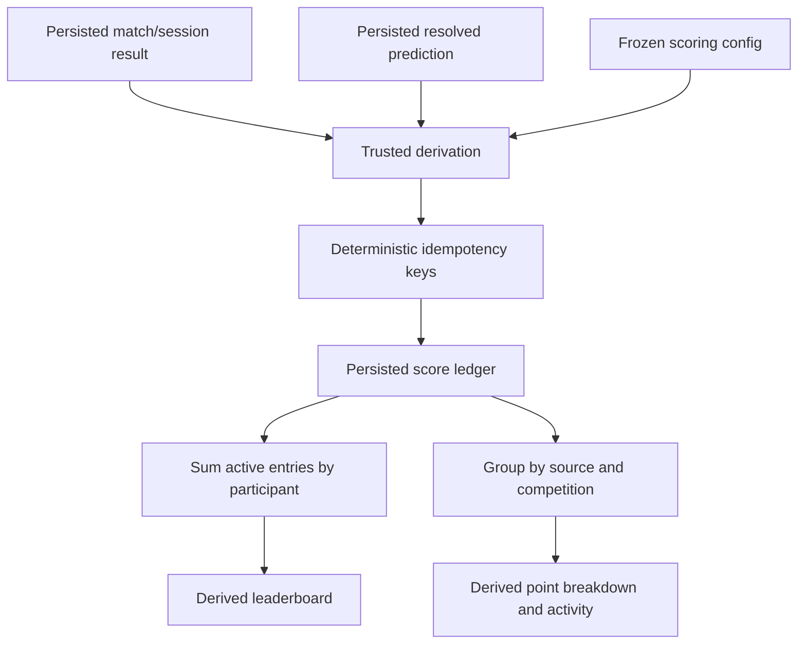

# Domain and Firebase data model

## 1. Modeling principles

1. Firebase Authentication UIDs identify actors; stable participant IDs identify players. Never use a display name as a foreign key.
2. Authoritative inputs are separated from derived read models. A client may display a cached derivation but cannot award championship points.
3. Confirmed generated fixtures and groups become persisted source-of-truth data. A generator must not run on every client.
4. Multi-path writes, transactions, or trusted functions keep result, derivation, and audit revisions consistent.
5. Public paths contain only data safe to download to every authenticated guest. Security Rules do not filter a collection after download.
6. Secrets, protected codes, prepublication reveal payloads, individual private submissions, individual predictions, and exact private addresses never enter public paths.
7. Realtime Database keys use opaque IDs or neutral terms. User text is stored as values after validation, never interpolated into paths.

## 2. Shared TypeScript conventions

These interfaces describe values after Firebase has resolved server timestamps. Create/update DTOs should omit server-controlled fields and use `serverTimestamp()`/`ServerValue.TIMESTAMP`. IDs are repeated in values where this improves validation/export; the key remains authoritative.

```ts
type EntityId = string;
type UserId = string;
type ParticipantId = EntityId;
type CompetitionId = EntityId;
type MatchId = EntityId;
type SessionId = EntityId;
type EventId = EntityId;
type UnixMs = number;

type SchemaVersion = 1;
type CompetitionFormat =
  | 'round-robin-knockout'
  | 'all-hands'
  | 'group-knockout';

interface AuditFields {
  schemaVersion: SchemaVersion;
  createdAt: UnixMs;
  createdBy: UserId;
  updatedAt: UnixMs;
  updatedBy: UserId;
  revision: number; // starts at 1; increments on accepted admin mutation
}

type RecordStatus = 'active' | 'archived';
// Full execution lifecycle targeted from Phase 4 onward.
type CompetitionStatus =
  | 'draft'
  | 'preview'
  | 'ready'
  | 'active'
  | 'locked'
  | 'completed'
  | 'archived';
type StageStatus = 'pending' | 'active' | 'locked' | 'completed';
type PlayStatus = 'scheduled' | 'ready' | 'in-progress' | 'completed' | 'void';
```

Database object maps use `Record<string, T>` and omit absent keys rather than writing `undefined`. Empty collections may be omitted. `null` is used only as a Firebase deletion instruction or an explicitly modeled result value.

## 3. Identity and participants

```ts
interface UserProfile extends AuditFields {
  id: UserId;
  authKind: 'anonymous' | 'persistent';
  participantId?: ParticipantId;
  displayName?: string; // convenience only, never authorization
  status: RecordStatus;
  lastSeenAt?: UnixMs;
}

interface Participant extends AuditFields {
  id: ParticipantId;
  ownerUid?: UserId; // at most one linked guest account
  displayName: string;
  avatarKey?: string; // allowlisted local/system avatar key
  initials?: string;
  status: 'active' | 'inactive' | 'archived';
  joinedAt: UnixMs;
}
```

`ownerUid` is a convenience association, not an admin role. Organizer status is read only from the verified custom claim. Guest profile creation must atomically prevent two participant records from claiming one UID and prevent a UID from overwriting another participant.

### Phase 2 implemented participant slice

Phase 2 deliberately implements a smaller versioned slice before competition models begin:

```ts
interface Phase2UserProfile {
  uid: string;
  participantId: string | null;
  createdAt: UnixMs;
  updatedAt: UnixMs;
  schemaVersion: 1;
}

interface Phase2Participant {
  id: ParticipantId;
  ownerUid: UserId | null;
  displayName: string; // normalized, 2–24 characters
  avatar: {
    icon: 'castle' | 'dice' | 'trophy' | 'controller' | 'crown' | 'sparkles';
    tone: 'cyan' | 'gold' | 'red' | 'neutral';
  };
  status: 'active' | 'inactive';
  createdAt: UnixMs;
  createdByUid: UserId;
  updatedAt: UnixMs;
  updatedByUid: UserId;
  schemaVersion: 1;
}
```

The implemented paths are `/userProfiles/{uid}` and `/participants/{participantId}`. Guest-created participant IDs equal their anonymous UID and have that UID as `ownerUid`. Organizer-created IDs are Firebase push IDs and have conceptual `ownerUid: null`; because Realtime Database treats written `null` as deletion, that field is absent on the wire and decoded to `null` by the client adapter. Only active participants are returned by the authenticated guest roster query. Inactive records are retained for organizer management rather than deleted.

## 4. Competition configuration

```ts
type SeriesKind = 'single' | 'best-of' | 'first-to';

interface MatchSeries {
  kind: SeriesKind;
  bestOf?: 3 | 5 | 7;       // present only for kind='best-of'
  firstTo?: number;         // positive integer for kind='first-to'
  winsRequired: number;     // derived at creation, persisted for clarity
  drawPolicy: 'not-allowed' | 'configured';
  maxRounds?: number;
}

interface TableScoringConfig {
  winPoints: number;        // recommended 3
  lossPoints: number;       // recommended 0
  drawPoints?: number;      // recommended 1 when draws enabled
}

interface ChampionshipScoringConfig {
  matchWinPoints: number;       // recommended 2
  roundWinPoints: number;       // recommended 1
  participationPoints: number;  // recommended 0/off
  qualificationPoints?: number;
  competitionWinPoints?: number;
}

interface PlacementAward {
  place: number;
  points: number;
}

interface ScoringConfig {
  schemaVersion: SchemaVersion;
  table?: TableScoringConfig;
  championship: ChampionshipScoringConfig;
  placementAwards?: PlacementAward[];
  winnerBonusPoints?: number;
  tiePolicy?: 'shared' | 'average-occupied' | 'organizer-tiebreak';
  teamAwardPolicy?: 'each-member' | 'split';
}

type TiebreakRule =
  | 'table-points'
  | 'head-to-head'
  | 'round-differential'
  | 'rounds-won'
  | 'match-wins'
  | 'numeric-score'
  | 'organizer-decision';

interface RoundRobinKnockoutConfig {
  kind: 'round-robin-knockout';
  series: MatchSeries;
  qualifierCount: number; // valid even count, <= participant count
  includeThirdPlace: boolean;
  tiebreaks: TiebreakRule[];
}

type AllHandsResultMode =
  | 'winner-only'
  | 'placement'
  | 'highest-score'
  | 'lowest-score'
  | 'custom';

interface CustomFieldDefinition {
  key: string;
  label: string;
  valueType: 'number' | 'short-text' | 'boolean';
  required: boolean;
}

interface AllHandsConfig {
  kind: 'all-hands';
  defaultResultMode: AllHandsResultMode;
  standingMode: 'session-history-only' | 'cumulative-awards';
  allowTeams: boolean;
  customFields?: CustomFieldDefinition[];
}

interface GroupKnockoutConfig {
  kind: 'group-knockout';
  groupCountMode: 'automatic' | 'manual';
  groupCount?: number;
  qualifiersPerGroup: number;
  roundRobinLegs: 1 | 2;
  series: MatchSeries;
  includeThirdPlace: boolean;
  tiebreaks: TiebreakRule[];
}

type FormatConfig =
  | RoundRobinKnockoutConfig
  | AllHandsConfig
  | GroupKnockoutConfig;

interface Competition extends AuditFields {
  id: CompetitionId;
  name: string; // user-entered; game-independent engine
  description?: string;
  format: CompetitionFormat;
  formatConfig: FormatConfig; // kind must equal format
  scoringConfig: ScoringConfig;
  participantIds: ParticipantId[]; // frozen when draw/session starts
  status: CompetitionStatus;
  activeStageId?: EntityId;
  activePlayId?: MatchId | SessionId;
  generationRevision: number;
  startedAt?: UnixMs;
  completedAt?: UnixMs;
  archivedAt?: UnixMs;
}
```

Validation enforces that the `format`, `formatConfig.kind`, permitted scoring fields, and active entity types agree. Configuration objects are copied into a competition rather than referencing a mutable global default.

### Phase 3 implemented competition slice

Phase 3 implements the configuration subset separately from the future execution model above. The exact persisted statuses are `draft`, `scheduled`, and `archived`; `scheduled` is a published configuration with fixtures pending. No stage, group, fixture, match, session, result, standing, or ledger record is created.

```ts
type Phase3CompetitionStatus = 'draft' | 'scheduled' | 'archived';

type Phase3SeriesConfig =
  | { kind: 'single'; winsRequired: 1; maximumRounds: 1 }
  | { kind: 'best-of'; maximumRounds: 3 | 5 | 7; winsRequired: 2 | 3 | 4 }
  | { kind: 'first-to'; winsRequired: number; maximumRounds: number };

interface Phase3CompetitionBase {
  id: CompetitionId;
  title: string;
  gameName: string;
  description: string;
  iconKey: 'trophy' | 'route' | 'users' | 'dice' | 'controller' | 'crown';
  format: CompetitionFormat;
  participantIds: ParticipantId[];
  formatConfig: Phase3FormatConfig;   // discriminant must equal format
  scoringConfig: Phase3ScoringConfig; // configuration only; awards nothing yet
  displayOrder: number;
  createdAt: UnixMs;
  updatedAt: UnixMs;
  createdByUid: UserId;
  updatedByUid: UserId;
  revision: number;
  schemaVersion: 1;
}

interface Phase3CompetitionDraft extends Phase3CompetitionBase {
  status: 'draft';
}

interface Phase3PublishedCompetition extends Phase3CompetitionBase {
  status: 'scheduled' | 'archived';
  publishedAt: UnixMs;
  publishedByUid: UserId;
}
```

`Phase3FormatConfig` is the implemented discriminated union for Merry-Go-Round settings (`series`, draws toggle, qualifier count, third-place toggle), All Hands settings (result mode, planned/open-ended sessions, teams toggle, generic metric labels/directions, negative-score toggle, and tie policy), and Group Format settings (automatic/manual group count, qualifiers per group, one/two legs, series, draws, third place). `Phase3ScoringConfig` separates head-to-head table points from championship-preview awards, or stores All Hands placement/winner/participation awards. Phases 4–6 freeze and execute Merry-Go-Round, All Hands, and Group Format values respectively.

The implemented paths are `/competitionDrafts/{competitionId}`, `/competitions/{competitionId}`, and `/audit/{auditId}`. Publishing is one multi-location write: create the `scheduled` record at the same ID, remove the draft, and append compact audit metadata. Published edits, archive/restore, and reorders increment revisions; reordering increments every changed record because `displayOrder` is versioned state. Optional null metric labels are omitted by Realtime Database and normalized back to `null` by the runtime adapter. Participant membership stores IDs only, so display profile changes can render without rewriting the selected membership.

### 4.1 Phase 4 Merry-Go-Round runtime

Phase 4 extends published Merry-Go-Round records to `scheduled | active | completed | archived` and adds one runtime at `/competitionRuns/{competitionId}`. Activation atomically creates the run, changes the source competition from `scheduled` to `active`, and appends activation/draw audit entries. Completion and reopening likewise update the competition, runtime, and audit in one multi-location mutation. A pre-result reset is the only whole-run deletion: it removes the run and returns the unchanged configuration to `scheduled`; started runs use result correction instead.

```ts
interface CompetitionRun {
  competitionId: CompetitionId;
  format: 'round-robin-knockout';
  stage: 'round-robin' | 'qualification-review' | 'knockout' | 'completed';
  competitionRevision: number;
  participantIds: ParticipantId[];
  participantIndex: Record<ParticipantId, true>;
  randomizedParticipantIds: ParticipantId[];
  randomizedPositions: Record<ParticipantId, number>;
  configSnapshot: {
    format: 'round-robin-knockout';
    series: MatchSeries;
    allowDraws: false;
    qualificationCount: number;
    includeThirdPlace: boolean;
    tableScoring: HeadToHeadTableScoring;
    overallScoring: HeadToHeadOverallScoring;
  };
  roundRobin: {
    fixtureRoundCount: number;
    expectedMatchCount: number;
    rounds: Array<{
      number: number;
      matchIds: MatchId[];
      byeParticipantId: ParticipantId | null;
    }>;
  };
  matches: Record<MatchId, CompetitionMatch>;
  tieResolutions: Record<EntityId, TieResolution>;
  knockout: KnockoutRuntime | null;
  placements: PlacementSnapshot | null;
  currentMatchId: MatchId | null;
  resultCount: number;
  generationVersion: 1;
  activatedAt: UnixMs;
  activatedByUid: UserId;
  completedAt: UnixMs | null;
  completedByUid: UserId | null;
  revision: number;
  schemaVersion: 1;
}
```

The immutable snapshot contains participant IDs, configuration revision, format, series, qualification/third-place settings, table and overall scoring, the secure shuffled order, generation version, and activation identity. Display names and avatars continue resolving by participant ID, so profile presentation may change without changing historical membership.

Persisted sources of truth are the snapshot, randomized order, generated fixture identities/order, round-winner sequences, explicit tie decisions with result fingerprints, knockout dependency graph/seeds, completion placements, revisions, and audit events. Standings, match/round totals, current leader, next recommended match, progress, and itemized projected competition points are pure derivations. Phase 4 creates no `/scoreLedger`; the cross-competition ledger remains Phase 7.

Realtime Database omits `null` properties and empty maps. The Phase 4 runtime adapter restores optional match slots, bracket fields, BYEs, empty tie maps, absent knockout/placement/completion state, and null placement ranks before validating the complete record. Any malformed collection item is quarantined rather than partially rendered.

## 5. Head-to-head stages and matches

```ts
interface MatchResult {
  participantAWins: number;
  participantBWins: number;
  roundWinnerIds: ParticipantId[];
  winnerId?: ParticipantId;
  isDraw: boolean;
  completedAt: UnixMs;
  enteredBy: UserId;
  correctionReason?: string;
  resultRevision: number;
}

interface Match extends AuditFields {
  id: MatchId;
  competitionId: CompetitionId;
  stageId: EntityId;
  stageKind: 'round-robin' | 'group' | 'knockout';
  sequence: number;
  generatedRound?: number;
  groupId?: EntityId;
  bracketRound?: number;
  bracketSlot?: number;
  participantAId?: ParticipantId;
  participantBId?: ParticipantId;
  sourceMatchIds?: MatchId[]; // for bracket advancement
  series: MatchSeries;
  status: PlayStatus;
  result?: MatchResult;
}

interface RoundRobinStage extends AuditFields {
  id: EntityId;
  competitionId: CompetitionId;
  status: StageStatus;
  shuffledParticipantIds: ParticipantId[];
  matchIds: MatchId[]; // official shared sequence
  expectedMatchCount: number;
  generationRevision: number;
}

interface BracketSlot {
  seed?: number;
  participantId?: ParticipantId;
  source?: { matchId: MatchId; outcome: 'winner' | 'loser' };
  isBye?: boolean;
}

interface KnockoutRound {
  roundNumber: number;
  label: string;
  matchIds: MatchId[];
}

interface KnockoutStage extends AuditFields {
  id: EntityId;
  competitionId: CompetitionId;
  status: StageStatus;
  qualifierParticipantIds: ParticipantId[];
  initialSlots: BracketSlot[];
  rounds: KnockoutRound[];
  thirdPlaceMatchId?: MatchId;
  sourceStandingsRevision: number;
}
```

Pairings live in `Match`, while stages preserve generation inputs and official order. A match result is authoritative input. Its status, standings, bracket advancement, and score entries are derivable. Persisting advancement slots as a cache is safe only with `sourceStandingsRevision`/source match revisions and trusted recalculation.

## 6. Groups

```ts
interface Group extends AuditFields {
  id: EntityId;
  competitionId: CompetitionId;
  groupStageId: EntityId;
  label: string; // e.g. generated neutral display label
  sequence: number;
  participantIds: ParticipantId[];
  matchIds: MatchId[];
}

interface QualificationMapping {
  groupId: EntityId;
  rank: number;
  knockoutSeed: number;
}

interface GroupStage extends AuditFields {
  id: EntityId;
  competitionId: CompetitionId;
  status: StageStatus;
  shuffledParticipantIds: ParticipantId[];
  groupIds: EntityId[];
  roundRobinLegs: 1 | 2;
  qualificationMappings: QualificationMapping[];
  generationRevision: number;
}
```

On confirmation, `shuffledParticipantIds`, groups, mappings, and fixtures are one logical write. `Group.participantIds` is an intentional denormalization needed for compact rendering and validation; membership is not editable after confirmation.

### 6.1 Phase 6 Group Format runtime

Phase 6 uses the same flat `/competitionRuns/{competitionId}` path and competition lifecycle as the other implemented formats. The local draw preview is never persisted as a separate record. Confirmation atomically creates the exact run below, changes the scheduled competition to `active`, and appends compact activation/draw audit entries.

```ts
interface GroupKnockoutRun {
  competitionId: CompetitionId;
  format: 'group-knockout';
  stage: 'group-stage' | 'qualification-review' | 'knockout' | 'completed';
  competitionRevision: number;
  participantIds: ParticipantId[];
  participantIndex: Record<ParticipantId, true>;
  configSnapshot: {
    format: 'group-knockout';
    groupCountMode: 'automatic' | 'manual';
    resolvedGroupCount: number;
    qualifiersPerGroup: number;
    roundRobinLegs: 1 | 2;
    series: MatchSeries;
    allowDraws: false;
    includeThirdPlace: boolean;
    tableScoring: HeadToHeadTableScoring;
    overallScoring: HeadToHeadOverallScoring;
    expectedGroupMatchCount: number;
    drawVersion: 1;
    fixtureGenerationVersion: 1;
    seedingVersion: 1;
  };
  draw: {
    shuffledParticipantIds: ParticipantId[];
    shuffledPositions: Record<ParticipantId, number>;
    assignments: Array<{
      participantId: ParticipantId;
      shuffledPosition: number;
      groupId: EntityId;
      positionInGroup: number;
    }>;
    generatedAt: UnixMs;
    drawVersion: 1;
  };
  groups: Array<{
    id: EntityId;
    label: string;
    participantIds: ParticipantId[];
  }>;
  matches: Record<MatchId, Match>;
  tieResolutions: Record<EntityId, GroupTieResolution>;
  qualification: QualificationSnapshot | null;
  seedResolutions: Record<EntityId, CrossGroupSeedResolution>;
  knockout: KnockoutRuntime | null;
  placements: PlacementSnapshot | null;
  currentMatchId: MatchId | null;
  resultCount: number;
  activatedAt: UnixMs;
  activatedByUid: UserId;
  completedAt: UnixMs | null;
  completedByUid: UserId | null;
  revision: number;
  schemaVersion: 1;
}
```

The authoritative Group Format inputs are the frozen configuration and expected group-match count, confirmed shuffled order/positions/assignments, stable groups, interleaved match identities, round-winner sequences, fingerprinted group tie decisions, frozen qualification snapshot, fingerprinted cross-group seed decisions, bracket dependencies/BYEs, completion placements, revisions, and audit entries. Group standings, normalized seed comparisons, next match, progress, public summaries, and itemized projected points are derived. Correcting a group result invalidates qualification and stale tie decisions; if a knockout exists, the organizer must explicitly reset that complete bracket first. A pre-result reset is the only whole-run deletion.

The strict adapter verifies unique/stable group IDs and labels, exact participant coverage and balanced size, draw-to-group assignment positions, one/two fixtures for every in-group pair with reversed second-leg sides, contiguous global order, valid result series, qualification membership/ranks/fingerprints, seed-resolution fingerprints, standard bracket slots/dependencies/BYEs, and completion placements. Unknown or malformed data quarantines the run instead of partially rendering it.

## 7. All Hands sessions

```ts
interface AllHandsConfigSnapshot {
  format: 'all-hands';
  resultMode: 'winner-only' | 'placement' | 'highest-score' | 'lowest-score' | 'custom';
  sessionPlan:
    | { kind: 'fixed'; plannedSessionCount: number }
    | { kind: 'open-ended' };
  allowTeams: boolean;
  teamAwardPolicy: 'each-member';
  metrics: {
    primaryLabel: string | null;
    primaryDirection: 'higher' | 'lower';
    secondaryLabel: string | null;
    secondaryDirection: 'higher' | 'lower' | null;
    allowNegativeScores: boolean;
  };
  tieHandling: 'shared-placement' | 'manual-order';
  winnerBonus: number;
  participationPoints: number;
  placementPoints: Array<{ place: number; points: number }>;
}

interface AllHandsTeam {
  id: EntityId;
  name: string;
  participantIds: ParticipantId[];
}

type AllHandsSessionResult =
  | { kind: 'winner-only'; winnerEntityId: EntityId; /* common metadata */ }
  | { kind: 'placement'; entries: Array<{ entityId: EntityId; placement: number }>; /* metadata */ }
  | {
      kind: 'numeric';
      mode: 'highest-score' | 'lowest-score';
      entries: Array<{
        entityId: EntityId;
        primaryScore: number;
        secondaryScore: number | null;
      }>;
      manualOrderEntityIds: EntityId[] | null;
      /* metadata */
    }
  | {
      kind: 'custom';
      entries: Array<{ entityId: EntityId; points: number; note: string | null }>;
      /* metadata */
    };

interface AllHandsCompetitionRun {
  competitionId: CompetitionId;
  format: 'all-hands';
  stage: 'sessions' | 'completion-review' | 'completed';
  competitionRevision: number;
  eligibleParticipantIds: ParticipantId[];
  eligibleParticipantIndex: Record<ParticipantId, true>;
  configSnapshot: AllHandsConfigSnapshot;
  sessions: Record<SessionId, AllHandsSession>;
  tieResolutions: Record<EntityId, AllHandsTieResolution>;
  placements: AllHandsPlacementSnapshot | null;
  currentSessionId: SessionId | null;
  sessionCount: number;
  resultCount: number;
  createdAt: UnixMs;
  updatedAt: UnixMs;
  activatedAt: UnixMs;
  activatedByUid: UserId;
  completedAt: UnixMs | null;
  completedByUid: UserId | null;
  revision: number;
  schemaVersion: 1;
}

interface AllHandsSession {
  id: SessionId;
  competitionId: CompetitionId;
  sequence: number;
  title: string;
  mode: 'individual' | 'team';
  participantIds: ParticipantId[];
  participantIndex: Record<ParticipantId, true>;
  teams: Record<EntityId, AllHandsTeam>;
  teamAssignments: Record<ParticipantId, EntityId>;
  entityIds: EntityId[];
  entityIndex: Record<EntityId, true>;
  status: 'pending' | 'in-progress' | 'completed' | 'voided';
  result: AllHandsSessionResult | null;
  revision: number;
  schemaVersion: 1;
  // creation/start/completion/void metadata is stored explicitly
}

interface AllHandsTieResolution {
  id: EntityId;
  participantIds: ParticipantId[];
  orderedParticipantIds: ParticipantId[];
  reason: string | null;
  standingsFingerprint: string;
  resolvedAt: UnixMs;
  resolvedByUid: UserId;
  schemaVersion: 1;
}

interface AllHandsPlacementSnapshot {
  entries: Array<{
    participantId: ParticipantId;
    place: number;
    totalCompetitionPoints: number;
    sessionWins: number;
    secondPlaceFinishes: number;
    thirdPlaceFinishes: number;
    completionAwards: number;
  }>;
  completedAt: UnixMs;
  completedByUid: UserId;
  runtimeRevision: number;
  schemaVersion: 1;
}
```

The common result metadata contains the complete `entityIndex`, `completedAt`, `completedByUid`, and `resultRevision`. Realtime Database omits null properties and empty maps; the runtime adapter restores those optional values before validating the whole run. It rejects unknown keys, invalid stages/statuses, duplicate or outside participants, invalid/overlapping teams, incomplete result coverage, malformed numeric/custom values, stale completion snapshots, and invalid tie resolutions. One malformed runtime is quarantined without crashing other competition cards.

For team sessions, every selected participant appears in exactly one non-empty session-local team and result entity IDs reference those stable team IDs. The pure derivation expands each team award in full to every member under `teamAwardPolicy: 'each-member'`. Individual sessions map entity IDs directly to participant IDs.

Persisted All Hands sources of truth are the frozen snapshot and eligibility, session definitions/membership, raw result inputs and revisions, void metadata, explicit final tie orders with standings fingerprints, final placement snapshot, and audit events. Session awards, standings, placement/win counts, average placement, progress, and itemized competition points are rebuilt from that source. The runtime contains no total or ledger field; Phase 7 writes its normalized external competition source atomically beside runtime mutations.

Fixed plans may enter completion review only after the configured number of non-voided completed sessions; open-ended plans require at least one. Completion atomically moves both competition and run to `completed`. Reopen preserves sessions/results, removes final placement/completion/tie metadata, and returns the run to `sessions`. Before any result, reset may remove the runtime and return the unchanged competition to `scheduled`.

## 8. Standings and championship ledger

Phase 7 implements the namespaced ledger below. The older `Standing` and `ChampionshipScoreEntry` interfaces in this section remain conceptual future/cache shapes; the current authoritative competition source uses `CompetitionLedgerSnapshot` and is never reduced to a mutable total.

```ts
interface CompetitionLedgerSnapshot {
  meta: {
    competitionId: string;
    competitionFormat: CompetitionFormat;
    competitionStatus: 'active' | 'completed';
    competitionTitle: string;
    runRevision: number;
    sourceFingerprint: string;
    generatedAt: number;
    generatedBy: 'organizer'; // public-safe marker; actor UID remains in organizer-only audit
    entryCount: number;
    schemaVersion: 1;
  };
  entries: Record<string, ChampionshipLedgerEntry>;
}

interface ChampionshipLedgerEntry {
  id: string; // deterministic path-safe hash of logical source identity
  participantId: string;
  sourceNamespace: 'competition';
  sourceId: string; // competition ID
  sourceEntityId: string; // match, session, qualification, or placement source
  sourceType: ChampionshipAwardType;
  points: number;
  label: string;
  competitionId: string;
  competitionFormat: CompetitionFormat;
  stage: string | null;
  awardedAt: number;
  sourceRevision: number;
  schemaVersion: 1;
}
```

The implemented award union covers match wins, round wins, match participation, session wins/placements/participation/custom awards, qualification, and the three competition podium places. Zero awards are omitted. The entry identity hashes competition, participant, award type, source entity, and optional discriminator after canonical serialization; display names never participate.

One runtime mutation replaces the complete `/championshipLedger/competitionSources/{competitionId}` source. Reopen, correction, session void/restore, knockout reset, and pre-result run reset therefore remove unsupported entries rather than adding compensating corrections. The source fingerprint covers the authoritative run revision, canonical scoring configuration, status, and stable sorted entries; metadata also exposes the revision explicitly for validation and reconciliation.

```ts
interface Standing {
  schemaVersion: SchemaVersion;
  competitionId: CompetitionId;
  stageId: EntityId;
  participantId: ParticipantId;
  rank: number;
  tied: boolean;
  played: number;
  matchWins: number;
  matchLosses: number;
  draws: number;
  tablePoints: number;
  roundsWon: number;
  roundsLost: number;
  roundDifferential: number;
  numericScore?: number;
  decidedBy?: TiebreakRule;
  sourceRevision: number;
  computedAt: UnixMs;
}

type ScoreSourceType =
  | 'match-win'
  | 'round-win'
  | 'placement'
  | 'qualification'
  | 'competition-win'
  | 'prediction'
  | 'participation'
  | 'admin-bonus'
  | 'correction';

interface ChampionshipScoreEntry {
  id: EntityId;
  schemaVersion: SchemaVersion;
  participantId: ParticipantId;
  sourceType: ScoreSourceType;
  sourceEntityId: EntityId;
  competitionId?: CompetitionId;
  points: number;
  reason: string;
  idempotencyKey: string;
  sourceRevision: number;
  status: 'active' | 'void';
  createdAt: UnixMs;
  createdBy: UserId; // admin UID or trusted function identity marker
  voidedAt?: UnixMs;
  voidedBy?: UserId;
  voidReason?: string;
}
```

`Standing` is derived and is not persisted in Phase 7. The implemented ledger is authenticated-readable and written only by the authorized organizer client through exact Rules-validated full-source or bonus operations. Leaderboard totals, ranks, recent awards, contributions, and achievements are derived views. Never persist a client-editable `totalPoints` as source of truth.

Idempotency keys are deterministically constructed from source type, source entity/revision unit, participant, and rule. They are indexed in a backend-only map for atomic claim/upsert. Correcting a source creates the complete expected set; obsolete entries become `void` (preferred for audit) or move to an archive. Public totals include only `active` entries.

### Score-ledger derivation flow



## 9. Birthday Vault

```ts
type BirthdayVaultStatus = 'collecting' | 'closed' | 'revealed';

interface BirthdayVaultPublicState {
  status: BirthdayVaultStatus;
  openedAt: UnixMs;
  openedByUid: UserId;
  closedAt: UnixMs | null;
  closedByUid: UserId | null;
  revealedAt: UnixMs | null;
  revealedByUid: UserId | null;
  revealRevision: number;
  updatedAt: UnixMs;
  updatedByUid: UserId;
  revision: number;
  schemaVersion: 1;
}

interface BirthdayMessage {
  ownerUid: UserId;
  participantId: ParticipantId;
  publicationId: string; // immutable browser-generated UUID
  title: string | null;
  message: string;
  emojiKey: 'cake' | 'heart' | 'sparkles' | 'crown' | 'castle' | 'confetti' | null;
  displayMode: 'named' | 'anonymous';
  status: 'submitted' | 'withdrawn';
  createdAt: UnixMs;
  updatedAt: UnixMs;
  revision: number;
  schemaVersion: 1;
}

interface BirthdaySubmissionReceipt {
  publicationId: string;
  active: boolean;
  updatedAt: UnixMs;
  schemaVersion: 1;
}

interface BirthdayMessageModeration {
  ownerUid: UserId;
  messageRevision: number;
  status: 'approved' | 'hidden';
  displayOrder: number | null;
  note: string | null;
  updatedAt: UnixMs;
  updatedByUid: UserId;
  revision: number;
  schemaVersion: 1;
}

interface PublishedBirthdayMessage {
  id: string; // opaque publication UUID; never an owner/participant ID
  title: string | null;
  message: string;
  emojiKey: BirthdayMessage['emojiKey'];
  author:
    | {
        mode: 'named';
        participantId: ParticipantId;
        displayName: string;
        avatarIcon: string;
        avatarTone: string;
      }
    | {
        mode: 'anonymous';
        participantId: null;
        displayName: 'Anonymous';
        avatarIcon: null;
        avatarTone: null;
      };
  displayOrder: number;
  sourceMessageRevision: number;
  publishedAt: UnixMs;
  revealRevision: number;
  schemaVersion: 1;
}
```

The implemented paths are `/birthdayVault/publicState`, `/birthdayVault/submissionReceipts/{publicationId}`, `/birthdayVault/privateMessages/{ownerUid}`, `/birthdayVault/moderation/{ownerUid}`, and `/birthdayVault/publishedMessages/{publicationId}`. One UID owns one retained message. Its owner/participant/publication identity and creation metadata are immutable; every edit, withdrawal, or resubmission advances the message revision and atomically updates the matching sanitized receipt.

No moderation record means pending. A moderation record is current only when `messageRevision` equals the private message revision, so an edit automatically returns the submission to review. Publication is a complete set derived from current approved submitted records. Named author data is snapshotted at publication; anonymous snapshots omit owner and participant identity. The public count is the number of valid active identity-free receipts, not a manually incremented total.

## 10. Prediction and reveal state

```ts
type PredictionOption = 'option-a' | 'option-b';

interface PredictionEvent extends AuditFields {
  id: EventId;
  status: 'draft' | 'open' | 'locked' | 'resolved' | 'archived';
  optionValues: ['option-a', 'option-b'];
  optionLabels?: Record<PredictionOption, string>; // reviewed dynamic display data
  correctPredictionPoints: number; // recommended 3
  openedAt?: UnixMs;
  lockedAt?: UnixMs;
  resolvedAt?: UnixMs;
  revealStateId: EntityId;
  showAggregateAfterReveal: boolean;
}

interface Prediction {
  schemaVersion: SchemaVersion;
  eventId: EventId;
  participantId: ParticipantId;
  ownerUid: UserId;
  selection: PredictionOption;
  createdAt: UnixMs;
  updatedAt: UnixMs;
  revision: number;
  resolvedAt?: UnixMs;
  outcome?: 'correct' | 'incorrect'; // backend-written only
}

interface RevealState extends AuditFields {
  id: EntityId;
  kind: 'birthday' | 'specialReveal';
  status: 'locked' | 'published';
  publicationId?: EntityId;
  publishedAt?: UnixMs;
  presentationVersion: number;
  publicPayload?: Record<string, string | number | boolean>; // sanitized only
}
```

Before resolution, only the owning UID and authorized organizers/backend can read an individual `Prediction`. `selection` accepts only the two neutral enum values. Correct outcome and scoring are backend-controlled. The special reveal's protected prepublication payload/code is deliberately absent from frontend domain types and public examples; it lives only in Secret Manager or backend-only storage.

Option labels are dynamic values, not enum keys. They must undergo content/privacy review before being placed in any client-readable path. Documentation and defaults remain neutral.

## 11. Settings, protected trip information, and audit

```ts
interface AppSettings extends AuditFields {
  id: 'app';
  tripTitle: string;
  tripStartDate: string; // '2026-07-31', ISO local calendar date
  tripEndDate: string;   // '2026-08-02', ISO local calendar date
  publicAccommodationArea: 'Žižkov, Prague 3';
  timezone: string;      // IANA name, e.g. Europe/Prague
  submissionsOpen: boolean;
  activeCompetitionId?: CompetitionId;
  activePredictionEventId?: EventId;
  maintenanceMessage?: string;
}

interface ProtectedTripInfo extends AuditFields {
  id: 'trip';
  exactAccommodationAddress?: string; // future authenticated/restricted use only
  accessNotes?: string;
  emergencyGroupNote?: string;
}

interface AuditEntry {
  id: EntityId;
  schemaVersion: SchemaVersion;
  occurredAt: UnixMs;
  actorUid: UserId;
  actorRole: 'organizer' | 'backend';
  action: string;
  entityType: string;
  entityId: EntityId;
  beforeRevision?: number;
  afterRevision?: number;
  reason?: string;
  requestId?: string;
  summary: string; // no secrets, codes, or protected content
}
```

Public `AppSettings` fixes the trip range to 31 July–2 August 2026 and the public accommodation copy to `Žižkov, Prague 3`; it otherwise contains only display-safe global state. `ProtectedTripInfo` is reserved for a later authenticated feature and is never compiled into Vite assets, static data, or mock data. Audit entries are append-only to clients, organizer-readable, and backend/admin-writable. They record metadata and safe summaries rather than duplicating private message bodies, prediction choices, protected codes, exact addresses, or reveal content.

## 12. Recommended Realtime Database tree

Path names are neutral and access-oriented. `$uid`, `$competitionId`, and similar segments are opaque generated IDs.

The implemented Phase 7–8 branches are:

```text
championshipLedger/
  competitionSources/{competitionId}/
    meta
    entries/{entryId}
  manualBonuses/{bonusId}                 # organizer-only active/revoked history
  manualBonusesPublic/{bonusId}           # authenticated active-only projection
birthdayVault/
  publicState                              # authenticated read; admin transitions
  submissionReceipts/{publicationId}      # authenticated sanitized count source
  privateMessages/{ownerUid}               # owner/admin read; owner collecting writes
  moderation/{ownerUid}                    # organizer only
  publishedMessages/{publicationId}        # authenticated read after reveal
```

The tree below remains the target for later protected/backend-derived features. The implemented Phase 2–8 subset is intentionally flat: `/userProfiles`, `/participants`, `/competitionDrafts`, `/competitions`, `/competitionRuns`, `/championshipLedger`, `/birthdayVault`, and `/audit`. A later migration must preserve compatibility and authorization rather than assuming the future tree already exists.

```text
/
  public/                                      # authenticated guest read; admin/backend write
    appSettings/app
    trip/
      itinerary/{itemId}
      general                                  # public area only: Žižkov, Prague 3
    participants/{participantId}
    competitions/{competitionId}
    stages/{competitionId}/{stageId}
    groups/{competitionId}/{groupId}
    matches/{competitionId}/{matchId}
    sessions/{competitionId}/{sessionId}
    standings/{competitionId}/{stageId}/{participantId}
    championship/
      scoreEntries/{scoreEntryId}
      leaderboard/{participantId}             # derived cache
      recent/{scoreEntryId}                    # bounded derived index
    birthday/
      state
      messageCount
      publications/{publicationId}/{messageId}
    predictionEvents/{eventId}                 # safe event state; no individual choices
    specialReveal/{revealStateId}              # locked marker or published safe snapshot only

  guestOwned/                                  # owner-scoped data; writes follow per-endpoint rules/callables
    userProfiles/{uid}
    participantClaims/{uid}
    birthdaySubmissions/{uid}/{messageId}
    predictions/{eventId}/{uid}

  organizer/                                   # auth.token.admin === true
    competitionDrafts/{competitionId}
    drawPreviews/{competitionId}/{previewId}
    moderation/birthday/{messageId}
    controls/
      birthday
      predictionEvents/{eventId}
      specialReveal/{revealStateId}            # control metadata only; no protected payload/code
    protectedTripInfo/trip

  backend/                                     # Admin SDK / trusted functions only
    specialReveal/{revealStateId}
    idempotency/{idempotencyKeyHash}
    operations/{requestId}
    rateLimits/{scopeHash}
    derivationState/{sourceEntityId}

  audit/                                       # organizer read; append-only backend/admin operation
    byTime/{pushId}
    byEntity/{entityType}/{entityId}/{pushId}
```

“Public” means readable by authenticated guests, not internet-indexable or safe for secrets. If itinerary reading before auth is desired later, only explicitly safe static itinerary fields may receive unauthenticated read access. Public accommodation data contains only `Žižkov, Prague 3`. The exact address is not populated anywhere for the static phase; a later authenticated implementation may place it under `organizer/protectedTripInfo` or another explicitly authenticated/restricted branch after separate authorization review.

In the future target, competition drafts live under `organizer`, while confirmed sanitized configuration/results live under `public`. The implemented flat model uses admin-claim Rules for configuration, all three runtimes, Phase 7 complete competition sources/bonuses, and Phase 8 Birthday Vault moderation/publication. The protected special reveal still requires its later trusted-operation design.

## 13. Source of truth, derivation, and denormalization

| Data | Persisted? | Authority | Notes |
|---|---|---|---|
| Participant identity/profile | Yes | Owner for limited fields; organizer for management | Participant ID is stable reference |
| Competition/config snapshot | Yes | Organizer | Authoritative after start |
| Confirmed shuffle/groups/fixture order | Yes | Organizer confirmation/backend operation | Generated once, then authoritative |
| Match/session result | Yes | Organizer under format-specific Rules | Authoritative versioned source |
| Standings | No for Phases 4–5 | Pure client derivation | Rebuildable from results/config; no independently mutable total |
| Championship competition sources | Yes | Rules-bounded organizer full-source operation | Authoritative current ledger; deterministic identity/fingerprint |
| Manual championship bonus | Yes | Rules-bounded organizer revisioned operation | Private full history plus sanitized active public projection |
| Leaderboard totals/ranks/recent list | No | Pure client derivation | Rebuilt from validated current sources and active bonuses |
| Private birthday submission | Yes | Guest create/limited own update; organizer moderate | Never in guest-readable collection |
| Published birthday snapshot | Yes | Rules-bounded organizer full-set operation | Sanitized public source for reveal presentation |
| Prediction | Yes | Owner while open; backend resolves | Private per UID |
| Aggregate prediction distribution | Optional persisted view | Backend | Publish only per configured policy |
| Reveal prepublication payload | Yes if needed | Backend only | Prefer Secret Manager for protected config |
| Published reveal snapshot/state | Yes | Backend | Guest-readable only after publication |
| Message count | No separate total | Pure count of valid active sanitized receipts | Does not grant submission or identity reads |

Safe denormalization includes participant display snapshots in historical presentation, stage IDs on matches, match IDs on stages, bounded recent-activity indexes, and leaderboard caches. Every cache declares the source revision/computation time. Do not denormalize protected content into audit, analytics, client logs, notification text, or public indexes.

## 14. Idempotency and concurrency

- A client assigns a unique `requestId` to each privileged request. The backend stores its terminal status and safe result under `backend/operations` so retries return the same outcome.
- Each derived score uses a logical `idempotencyKey`; the backend atomically claims its hashed lookup key and upserts one entry.
- Result updates carry `expectedRevision`. A transaction rejects stale revisions instead of silently overwriting another administrator.
- Reveal resolution checks event status, publication identity, and idempotency record in one trusted workflow. Partial retries continue missing steps but never duplicate awards.
- Multi-location fan-out updates are built server-side and committed atomically where Realtime Database limits allow. Long operations use explicit resumable states (`pending`, `applying`, `completed`, `failed`) under backend-only paths.

## 15. Deletion, correction, and archival

- Prefer status-based archival for competitions, participants with history, publications, and score entries. Public views exclude archived/void records by default.
- A draft with no references may be hard-deleted by an organizer after confirmation. A confirmed draw reset archives the old generation and results or records tombstones before deleting active paths.
- A result correction creates a revision/audit record and deterministically replaces the complete current competition source. It does not erase safe correction metadata from audit.
- Birthday submissions may be hidden rather than deleted during moderation. A privacy deletion request may hard-delete private content, but an already published copy requires a separate audited unpublish/redaction operation.
- Predictions are retained privately through resolution for audit, then removed or anonymized according to a retention period that organizers must decide before production.
- Audit metadata has its own retention policy and must avoid personal/sensitive payloads so retention does not become unintended disclosure.
- Referential checks prevent deleting a participant referenced by results; use `inactive`/`archived` instead.

## 16. Schema evolution

Top-level domain records include `schemaVersion` where migrations may be necessary. Readers accept the current version and explicitly supported prior versions; they do not guess missing semantics. Migrations run in a development project first, create a backup/export, use idempotent scripts or functions, and record counts/revisions. Client rollout must remain compatible with data already deployed until migration completion is verified.
