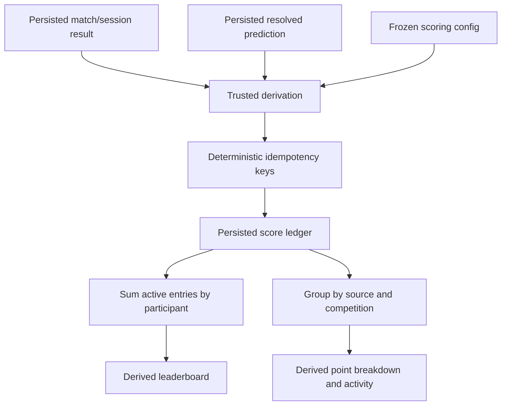

# Domain and Firebase data model

## 1. Modeling principles

1. Firebase Authentication UIDs identify actors; stable participant IDs identify players. Never use a display name as a foreign key.
2. Authoritative inputs are separated from derived read models. A client may display a cached derivation but cannot award championship points.
3. Confirmed generated fixtures and groups become persisted source-of-truth data. A generator must not run on every client.
4. Multi-path writes, transactions, or trusted functions keep result, derivation, and audit revisions consistent.
5. Public paths contain only data safe to download to every authenticated guest. Security Rules do not filter a collection after download.
6. Secrets, protected codes, prepublication reveal payloads, individual private submissions, individual predictions, and exact private addresses never enter public paths.
7. Realtime Database keys use opaque IDs or neutral terms. User text is stored as values after validation, never interpolated into paths.

## 2. Shared TypeScript conventions

These interfaces describe values after Firebase has resolved server timestamps. Create/update DTOs should omit server-controlled fields and use `serverTimestamp()`/`ServerValue.TIMESTAMP`. IDs are repeated in values where this improves validation/export; the key remains authoritative.

```ts
type EntityId = string;
type UserId = string;
type ParticipantId = EntityId;
type CompetitionId = EntityId;
type MatchId = EntityId;
type SessionId = EntityId;
type EventId = EntityId;
type UnixMs = number;

type SchemaVersion = 1;
type CompetitionFormat =
  | 'round-robin-knockout'
  | 'all-hands'
  | 'group-knockout';

interface AuditFields {
  schemaVersion: SchemaVersion;
  createdAt: UnixMs;
  createdBy: UserId;
  updatedAt: UnixMs;
  updatedBy: UserId;
  revision: number; // starts at 1; increments on accepted admin mutation
}

type RecordStatus = 'active' | 'archived';
type CompetitionStatus =
  | 'draft'
  | 'preview'
  | 'ready'
  | 'active'
  | 'locked'
  | 'completed'
  | 'archived';
type StageStatus = 'pending' | 'active' | 'locked' | 'completed';
type PlayStatus = 'scheduled' | 'ready' | 'in-progress' | 'completed' | 'void';
```

Database object maps use `Record<string, T>` and omit absent keys rather than writing `undefined`. Empty collections may be omitted. `null` is used only as a Firebase deletion instruction or an explicitly modeled result value.

## 3. Identity and participants

```ts
interface UserProfile extends AuditFields {
  id: UserId;
  authKind: 'anonymous' | 'persistent';
  participantId?: ParticipantId;
  displayName?: string; // convenience only, never authorization
  status: RecordStatus;
  lastSeenAt?: UnixMs;
}

interface Participant extends AuditFields {
  id: ParticipantId;
  ownerUid?: UserId; // at most one linked guest account
  displayName: string;
  avatarKey?: string; // allowlisted local/system avatar key
  initials?: string;
  status: 'active' | 'inactive' | 'archived';
  joinedAt: UnixMs;
}
```

`ownerUid` is a convenience association, not an admin role. Organizer status is read only from the verified custom claim. Guest profile creation must atomically prevent two participant records from claiming one UID and prevent a UID from overwriting another participant.

### Phase 2 implemented participant slice

Phase 2 deliberately implements a smaller versioned slice before competition models begin:

```ts
interface Phase2UserProfile {
  uid: string;
  participantId: string | null;
  createdAt: UnixMs;
  updatedAt: UnixMs;
  schemaVersion: 1;
}

interface Phase2Participant {
  id: ParticipantId;
  ownerUid: UserId | null;
  displayName: string; // normalized, 2–24 characters
  avatar: {
    icon: 'castle' | 'dice' | 'trophy' | 'controller' | 'crown' | 'sparkles';
    tone: 'cyan' | 'gold' | 'red' | 'neutral';
  };
  status: 'active' | 'inactive';
  createdAt: UnixMs;
  createdByUid: UserId;
  updatedAt: UnixMs;
  updatedByUid: UserId;
  schemaVersion: 1;
}
```

The implemented paths are `/userProfiles/{uid}` and `/participants/{participantId}`. Guest-created participant IDs equal their anonymous UID and have that UID as `ownerUid`. Organizer-created IDs are Firebase push IDs and have conceptual `ownerUid: null`; because Realtime Database treats written `null` as deletion, that field is absent on the wire and decoded to `null` by the client adapter. Only active participants are returned by the authenticated guest roster query. Inactive records are retained for organizer management rather than deleted.

## 4. Competition configuration

```ts
type SeriesKind = 'single' | 'best-of' | 'first-to';

interface MatchSeries {
  kind: SeriesKind;
  bestOf?: 3 | 5 | 7;       // present only for kind='best-of'
  firstTo?: number;         // positive integer for kind='first-to'
  winsRequired: number;     // derived at creation, persisted for clarity
  drawPolicy: 'not-allowed' | 'configured';
  maxRounds?: number;
}

interface TableScoringConfig {
  winPoints: number;        // recommended 3
  lossPoints: number;       // recommended 0
  drawPoints?: number;      // recommended 1 when draws enabled
}

interface ChampionshipScoringConfig {
  matchWinPoints: number;       // recommended 2
  roundWinPoints: number;       // recommended 1
  participationPoints: number;  // recommended 0/off
  qualificationPoints?: number;
  competitionWinPoints?: number;
}

interface PlacementAward {
  place: number;
  points: number;
}

interface ScoringConfig {
  schemaVersion: SchemaVersion;
  table?: TableScoringConfig;
  championship: ChampionshipScoringConfig;
  placementAwards?: PlacementAward[];
  winnerBonusPoints?: number;
  tiePolicy?: 'shared' | 'average-occupied' | 'organizer-tiebreak';
  teamAwardPolicy?: 'each-member' | 'split';
}

type TiebreakRule =
  | 'table-points'
  | 'head-to-head'
  | 'round-differential'
  | 'rounds-won'
  | 'match-wins'
  | 'numeric-score'
  | 'organizer-decision';

interface RoundRobinKnockoutConfig {
  kind: 'round-robin-knockout';
  series: MatchSeries;
  qualifierCount: number; // valid even count, <= participant count
  includeThirdPlace: boolean;
  tiebreaks: TiebreakRule[];
}

type AllHandsResultMode =
  | 'winner-only'
  | 'placement'
  | 'highest-score'
  | 'lowest-score'
  | 'custom';

interface CustomFieldDefinition {
  key: string;
  label: string;
  valueType: 'number' | 'short-text' | 'boolean';
  required: boolean;
}

interface AllHandsConfig {
  kind: 'all-hands';
  defaultResultMode: AllHandsResultMode;
  standingMode: 'session-history-only' | 'cumulative-awards';
  allowTeams: boolean;
  customFields?: CustomFieldDefinition[];
}

interface GroupKnockoutConfig {
  kind: 'group-knockout';
  groupCountMode: 'automatic' | 'manual';
  groupCount?: number;
  qualifiersPerGroup: number;
  roundRobinLegs: 1 | 2;
  series: MatchSeries;
  includeThirdPlace: boolean;
  tiebreaks: TiebreakRule[];
}

type FormatConfig =
  | RoundRobinKnockoutConfig
  | AllHandsConfig
  | GroupKnockoutConfig;

interface Competition extends AuditFields {
  id: CompetitionId;
  name: string; // user-entered; game-independent engine
  description?: string;
  format: CompetitionFormat;
  formatConfig: FormatConfig; // kind must equal format
  scoringConfig: ScoringConfig;
  participantIds: ParticipantId[]; // frozen when draw/session starts
  status: CompetitionStatus;
  activeStageId?: EntityId;
  activePlayId?: MatchId | SessionId;
  generationRevision: number;
  startedAt?: UnixMs;
  completedAt?: UnixMs;
  archivedAt?: UnixMs;
}
```

Validation enforces that the `format`, `formatConfig.kind`, permitted scoring fields, and active entity types agree. Configuration objects are copied into a competition rather than referencing a mutable global default.

## 5. Head-to-head stages and matches

```ts
interface MatchResult {
  participantAWins: number;
  participantBWins: number;
  roundWinnerIds: ParticipantId[];
  winnerId?: ParticipantId;
  isDraw: boolean;
  completedAt: UnixMs;
  enteredBy: UserId;
  correctionReason?: string;
  resultRevision: number;
}

interface Match extends AuditFields {
  id: MatchId;
  competitionId: CompetitionId;
  stageId: EntityId;
  stageKind: 'round-robin' | 'group' | 'knockout';
  sequence: number;
  generatedRound?: number;
  groupId?: EntityId;
  bracketRound?: number;
  bracketSlot?: number;
  participantAId?: ParticipantId;
  participantBId?: ParticipantId;
  sourceMatchIds?: MatchId[]; // for bracket advancement
  series: MatchSeries;
  status: PlayStatus;
  result?: MatchResult;
}

interface RoundRobinStage extends AuditFields {
  id: EntityId;
  competitionId: CompetitionId;
  status: StageStatus;
  shuffledParticipantIds: ParticipantId[];
  matchIds: MatchId[]; // official shared sequence
  expectedMatchCount: number;
  generationRevision: number;
}

interface BracketSlot {
  seed?: number;
  participantId?: ParticipantId;
  source?: { matchId: MatchId; outcome: 'winner' | 'loser' };
  isBye?: boolean;
}

interface KnockoutRound {
  roundNumber: number;
  label: string;
  matchIds: MatchId[];
}

interface KnockoutStage extends AuditFields {
  id: EntityId;
  competitionId: CompetitionId;
  status: StageStatus;
  qualifierParticipantIds: ParticipantId[];
  initialSlots: BracketSlot[];
  rounds: KnockoutRound[];
  thirdPlaceMatchId?: MatchId;
  sourceStandingsRevision: number;
}
```

Pairings live in `Match`, while stages preserve generation inputs and official order. A match result is authoritative input. Its status, standings, bracket advancement, and score entries are derivable. Persisting advancement slots as a cache is safe only with `sourceStandingsRevision`/source match revisions and trusted recalculation.

## 6. Groups

```ts
interface Group extends AuditFields {
  id: EntityId;
  competitionId: CompetitionId;
  groupStageId: EntityId;
  label: string; // e.g. generated neutral display label
  sequence: number;
  participantIds: ParticipantId[];
  matchIds: MatchId[];
}

interface QualificationMapping {
  groupId: EntityId;
  rank: number;
  knockoutSeed: number;
}

interface GroupStage extends AuditFields {
  id: EntityId;
  competitionId: CompetitionId;
  status: StageStatus;
  shuffledParticipantIds: ParticipantId[];
  groupIds: EntityId[];
  roundRobinLegs: 1 | 2;
  qualificationMappings: QualificationMapping[];
  generationRevision: number;
}
```

On confirmation, `shuffledParticipantIds`, groups, mappings, and fixtures are one logical write. `Group.participantIds` is an intentional denormalization needed for compact rendering and validation; membership is not editable after confirmation.

## 7. All Hands sessions

```ts
interface TeamEntry {
  teamId: EntityId;
  name: string;
  participantIds: ParticipantId[];
}

interface SessionEntrantResult {
  entrantId: ParticipantId | EntityId; // participantId or session-local teamId
  place?: number;
  numericScore?: number;
  isWinner?: boolean;
  customValues?: Record<string, number | string | boolean>;
}

interface AllHandsSession extends AuditFields {
  id: SessionId;
  competitionId: CompetitionId;
  sequence: number;
  name?: string;
  participantIds: ParticipantId[];
  teams?: TeamEntry[];
  resultMode: AllHandsResultMode;
  scoringConfig: ScoringConfig; // frozen session override or competition copy
  status: PlayStatus;
  results?: SessionEntrantResult[];
  resultRevision: number;
  completedAt?: UnixMs;
  correctionReason?: string;
}
```

For team sessions, all participant IDs appear in exactly one team and `entrantId` references a session-local `teamId`. The derivation expands team awards according to the frozen policy.

## 8. Standings and championship ledger

```ts
interface Standing {
  schemaVersion: SchemaVersion;
  competitionId: CompetitionId;
  stageId: EntityId;
  participantId: ParticipantId;
  rank: number;
  tied: boolean;
  played: number;
  matchWins: number;
  matchLosses: number;
  draws: number;
  tablePoints: number;
  roundsWon: number;
  roundsLost: number;
  roundDifferential: number;
  numericScore?: number;
  decidedBy?: TiebreakRule;
  sourceRevision: number;
  computedAt: UnixMs;
}

type ScoreSourceType =
  | 'match-win'
  | 'round-win'
  | 'placement'
  | 'qualification'
  | 'competition-win'
  | 'prediction'
  | 'participation'
  | 'admin-bonus'
  | 'correction';

interface ChampionshipScoreEntry {
  id: EntityId;
  schemaVersion: SchemaVersion;
  participantId: ParticipantId;
  sourceType: ScoreSourceType;
  sourceEntityId: EntityId;
  competitionId?: CompetitionId;
  points: number;
  reason: string;
  idempotencyKey: string;
  sourceRevision: number;
  status: 'active' | 'void';
  createdAt: UnixMs;
  createdBy: UserId; // admin UID or trusted function identity marker
  voidedAt?: UnixMs;
  voidedBy?: UserId;
  voidReason?: string;
}
```

`Standing` is derived and may be persisted as a public read model. `ChampionshipScoreEntry` is persisted authoritative ledger data generated from authoritative results/events; it is backend-write-only and can be public-readable after its `reason` is sanitized. Leaderboard totals and breakdowns are derived views. Never persist a client-editable `totalPoints` as source of truth.

Idempotency keys are deterministically constructed from source type, source entity/revision unit, participant, and rule. They are indexed in a backend-only map for atomic claim/upsert. Correcting a source creates the complete expected set; obsolete entries become `void` (preferred for audit) or move to an archive. Public totals include only `active` entries.

### Score-ledger derivation flow



## 9. Birthday Vault

```ts
interface BirthdayMessage extends AuditFields {
  id: EntityId;
  authorUid: UserId;
  displayName: string;
  title?: string;
  message: string;
  emoji?: string;
  anonymousDisplay: boolean;
  moderationStatus: 'pending' | 'approved' | 'hidden';
  moderatedAt?: UnixMs;
  moderatedBy?: UserId;
}

interface PublishedBirthdayMessage {
  id: EntityId; // new public snapshot ID; does not expose author UID
  schemaVersion: SchemaVersion;
  displayName?: string; // omitted/replaced when anonymousDisplay was chosen
  title?: string;
  message: string;
  emoji?: string;
  sequence: number;
  publishedAt: UnixMs;
  publicationId: EntityId;
}
```

Guests write under their own UID branch. The `moderationStatus` and moderation fields are server/admin controlled; create DTOs cannot set them to approved. Publication copies only approved, sanitized display fields into new public snapshot records. Editing a private record after publication does not mutate the published snapshot; republishing is a new audited publication revision.

The public message count is a backend-maintained aggregate. Guests cannot increment it directly and cannot infer private content from collection access.

## 10. Prediction and reveal state

```ts
type PredictionOption = 'option-a' | 'option-b';

interface PredictionEvent extends AuditFields {
  id: EventId;
  status: 'draft' | 'open' | 'locked' | 'resolved' | 'archived';
  optionValues: ['option-a', 'option-b'];
  optionLabels?: Record<PredictionOption, string>; // reviewed dynamic display data
  correctPredictionPoints: number; // recommended 3
  openedAt?: UnixMs;
  lockedAt?: UnixMs;
  resolvedAt?: UnixMs;
  revealStateId: EntityId;
  showAggregateAfterReveal: boolean;
}

interface Prediction {
  schemaVersion: SchemaVersion;
  eventId: EventId;
  participantId: ParticipantId;
  ownerUid: UserId;
  selection: PredictionOption;
  createdAt: UnixMs;
  updatedAt: UnixMs;
  revision: number;
  resolvedAt?: UnixMs;
  outcome?: 'correct' | 'incorrect'; // backend-written only
}

interface RevealState extends AuditFields {
  id: EntityId;
  kind: 'birthday' | 'specialReveal';
  status: 'locked' | 'published';
  publicationId?: EntityId;
  publishedAt?: UnixMs;
  presentationVersion: number;
  publicPayload?: Record<string, string | number | boolean>; // sanitized only
}
```

Before resolution, only the owning UID and authorized organizers/backend can read an individual `Prediction`. `selection` accepts only the two neutral enum values. Correct outcome and scoring are backend-controlled. The special reveal's protected prepublication payload/code is deliberately absent from frontend domain types and public examples; it lives only in Secret Manager or backend-only storage.

Option labels are dynamic values, not enum keys. They must undergo content/privacy review before being placed in any client-readable path. Documentation and defaults remain neutral.

## 11. Settings, protected trip information, and audit

```ts
interface AppSettings extends AuditFields {
  id: 'app';
  tripTitle: string;
  tripStartDate: string; // '2026-07-31', ISO local calendar date
  tripEndDate: string;   // '2026-08-02', ISO local calendar date
  publicAccommodationArea: 'Žižkov, Prague 3';
  timezone: string;      // IANA name, e.g. Europe/Prague
  submissionsOpen: boolean;
  activeCompetitionId?: CompetitionId;
  activePredictionEventId?: EventId;
  maintenanceMessage?: string;
}

interface ProtectedTripInfo extends AuditFields {
  id: 'trip';
  exactAccommodationAddress?: string; // future authenticated/restricted use only
  accessNotes?: string;
  emergencyGroupNote?: string;
}

interface AuditEntry {
  id: EntityId;
  schemaVersion: SchemaVersion;
  occurredAt: UnixMs;
  actorUid: UserId;
  actorRole: 'organizer' | 'backend';
  action: string;
  entityType: string;
  entityId: EntityId;
  beforeRevision?: number;
  afterRevision?: number;
  reason?: string;
  requestId?: string;
  summary: string; // no secrets, codes, or protected content
}
```

Public `AppSettings` fixes the trip range to 31 July–2 August 2026 and the public accommodation copy to `Žižkov, Prague 3`; it otherwise contains only display-safe global state. `ProtectedTripInfo` is reserved for a later authenticated feature and is never compiled into Vite assets, static data, or mock data. Audit entries are append-only to clients, organizer-readable, and backend/admin-writable. They record metadata and safe summaries rather than duplicating private message bodies, prediction choices, protected codes, exact addresses, or reveal content.

## 12. Recommended Realtime Database tree

Path names are neutral and access-oriented. `$uid`, `$competitionId`, and similar segments are opaque generated IDs.

```text
/
  public/                                      # authenticated guest read; admin/backend write
    appSettings/app
    trip/
      itinerary/{itemId}
      general                                  # public area only: Žižkov, Prague 3
    participants/{participantId}
    competitions/{competitionId}
    stages/{competitionId}/{stageId}
    groups/{competitionId}/{groupId}
    matches/{competitionId}/{matchId}
    sessions/{competitionId}/{sessionId}
    standings/{competitionId}/{stageId}/{participantId}
    championship/
      scoreEntries/{scoreEntryId}
      leaderboard/{participantId}             # derived cache
      recent/{scoreEntryId}                    # bounded derived index
    birthday/
      state
      messageCount
      publications/{publicationId}/{messageId}
    predictionEvents/{eventId}                 # safe event state; no individual choices
    specialReveal/{revealStateId}              # locked marker or published safe snapshot only

  guestOwned/                                  # owner-scoped data; writes follow per-endpoint rules/callables
    userProfiles/{uid}
    participantClaims/{uid}
    birthdaySubmissions/{uid}/{messageId}
    predictions/{eventId}/{uid}

  organizer/                                   # auth.token.admin === true
    competitionDrafts/{competitionId}
    drawPreviews/{competitionId}/{previewId}
    moderation/birthday/{messageId}
    controls/
      birthday
      predictionEvents/{eventId}
      specialReveal/{revealStateId}            # control metadata only; no protected payload/code
    protectedTripInfo/trip

  backend/                                     # Admin SDK / trusted functions only
    specialReveal/{revealStateId}
    idempotency/{idempotencyKeyHash}
    operations/{requestId}
    rateLimits/{scopeHash}
    derivationState/{sourceEntityId}

  audit/                                       # organizer read; append-only backend/admin operation
    byTime/{pushId}
    byEntity/{entityType}/{entityId}/{pushId}
```

“Public” means readable by authenticated guests, not internet-indexable or safe for secrets. If itinerary reading before auth is desired later, only explicitly safe static itinerary fields may receive unauthenticated read access. Public accommodation data contains only `Žižkov, Prague 3`. The exact address is not populated anywhere for the static phase; a later authenticated implementation may place it under `organizer/protectedTripInfo` or another explicitly authenticated/restricted branch after separate authorization review.

Competition drafts live under `organizer`; confirmed, sanitized competition configurations and results live under `public`. Organizer clients should invoke trusted operations to publish multi-path updates rather than copy partial trees themselves.

## 13. Source of truth, derivation, and denormalization

| Data | Persisted? | Authority | Notes |
|---|---|---|---|
| Participant identity/profile | Yes | Owner for limited fields; organizer for management | Participant ID is stable reference |
| Competition/config snapshot | Yes | Organizer | Authoritative after start |
| Confirmed shuffle/groups/fixture order | Yes | Organizer confirmation/backend operation | Generated once, then authoritative |
| Match/session result | Yes | Organizer | Authoritative versioned source |
| Standings | Optional persisted cache | Trusted derivation | Rebuildable from results/config |
| Championship score entries | Yes | Backend/trusted admin operation | Authoritative ledger, deterministic |
| Leaderboard totals/recent list | Optional persisted cache | Trusted derivation | Rebuildable from active ledger |
| Private birthday submission | Yes | Guest create/limited own update; organizer moderate | Never in guest-readable collection |
| Published birthday snapshot | Yes | Backend publish operation | Public source for reveal presentation |
| Prediction | Yes | Owner while open; backend resolves | Private per UID |
| Aggregate prediction distribution | Optional persisted view | Backend | Publish only per configured policy |
| Reveal prepublication payload | Yes if needed | Backend only | Prefer Secret Manager for protected config |
| Published reveal snapshot/state | Yes | Backend | Guest-readable only after publication |
| Message count | Persisted aggregate | Backend | Does not grant submission reads |

Safe denormalization includes participant display snapshots in historical presentation, stage IDs on matches, match IDs on stages, bounded recent-activity indexes, and leaderboard caches. Every cache declares the source revision/computation time. Do not denormalize protected content into audit, analytics, client logs, notification text, or public indexes.

## 14. Idempotency and concurrency

- A client assigns a unique `requestId` to each privileged request. The backend stores its terminal status and safe result under `backend/operations` so retries return the same outcome.
- Each derived score uses a logical `idempotencyKey`; the backend atomically claims its hashed lookup key and upserts one entry.
- Result updates carry `expectedRevision`. A transaction rejects stale revisions instead of silently overwriting another administrator.
- Reveal resolution checks event status, publication identity, and idempotency record in one trusted workflow. Partial retries continue missing steps but never duplicate awards.
- Multi-location fan-out updates are built server-side and committed atomically where Realtime Database limits allow. Long operations use explicit resumable states (`pending`, `applying`, `completed`, `failed`) under backend-only paths.

## 15. Deletion, correction, and archival

- Prefer status-based archival for competitions, participants with history, publications, and score entries. Public views exclude archived/void records by default.
- A draft with no references may be hard-deleted by an organizer after confirmation. A confirmed draw reset archives the old generation and results or records tombstones before deleting active paths.
- A result correction creates a revision/audit record and deterministically replaces or voids its derived ledger set. It does not erase the fact a correction occurred.
- Birthday submissions may be hidden rather than deleted during moderation. A privacy deletion request may hard-delete private content, but an already published copy requires a separate audited unpublish/redaction operation.
- Predictions are retained privately through resolution for audit, then removed or anonymized according to a retention period that organizers must decide before production.
- Audit metadata has its own retention policy and must avoid personal/sensitive payloads so retention does not become unintended disclosure.
- Referential checks prevent deleting a participant referenced by results; use `inactive`/`archived` instead.

## 16. Schema evolution

Top-level domain records include `schemaVersion` where migrations may be necessary. Readers accept the current version and explicitly supported prior versions; they do not guess missing semantics. Migrations run in a development project first, create a backup/export, use idempotent scripts or functions, and record counts/revisions. Client rollout must remain compatible with data already deployed until migration completion is verified.
