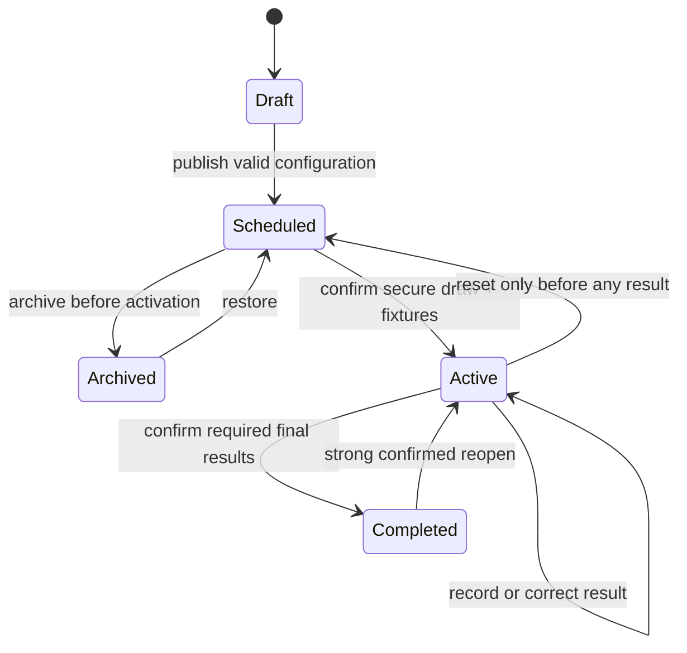
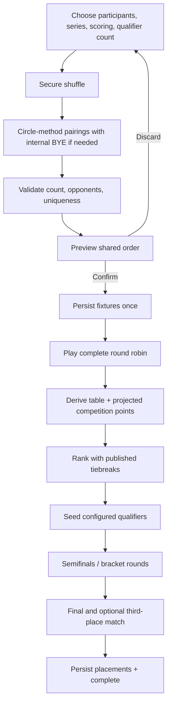
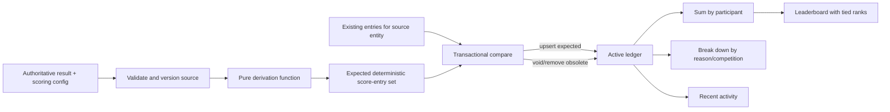

# Competition and scoring rules

## 1. Scope and terminology

This document is normative for competition behavior. A **competition** is a configured event in one of three generic formats. Its user-entered name is display data and never changes engine behavior. A **match** is a head-to-head contest; a **round** is one unit within a match series; a **session** is one simultaneous All Hands contest. **Table points** rank players inside one stage. **Championship points** enter the weekend-wide ledger.

Only these format identifiers are valid:

| `CompetitionFormat` | UI label | Intended structure |
|---|---|---|
| `round-robin-knockout` | Merry-Go-Round | One complete round robin followed by a configurable seeded knockout |
| `all-hands` | All Hands | One or more simultaneous multi-participant or team sessions |
| `group-knockout` | Group Format | Randomized groups, internal round robins, then cross-group knockout |

All numeric scoring rules are frozen in the competition's `scoringConfig` when play starts. A later configuration change is a versioned recalculation event, not an untracked edit.

## 2. Common competition lifecycle

The following competition lifecycle applies to all three formats.

### Phase 3 configuration and Phase 4–5 execution lifecycle

Phase 3 persists private `draft` records and published `scheduled`/`archived` configurations. Phase 4 adds `active` and `completed` execution for Merry-Go-Round (`round-robin-knockout`), and Phase 5 adds those states for All Hands (`all-hands`). Group Format remains configuration-only until Phase 6. Draw and activation reviews are organizer UI confirmations, not separately persisted `preview`, `ready`, or `locked` statuses.



### 2.1 Status invariants

- `draft`: configuration may change; no confirmed draw or runtime exists.
- `scheduled`: guest-readable configuration with fixtures pending; it may be edited, reordered, archived, or activated.
- `active`: one persisted immutable format-specific runtime snapshot exists; source format, participant eligibility, and scoring are frozen. Only claim-authorized organizer mutations may advance results.
- `completed`: required format-specific results and a placement snapshot exist; the run is read-only until a strong confirmed organizer reopen.
- `archived`: pre-activation configuration retained outside the public scheduled list. Active/completed runs are never archived or hard-deleted.

Display-name/avatar changes continue resolving by participant ID, but membership and rules never silently change. Reopening preserves fixtures/sessions/results, removes completion metadata and stale final tie decisions, returns to the format's active stage, increments revisions, and appends audit.

### 2.2 Merry-Go-Round organizer actions

| Action | Preconditions | Effect |
|---|---|---|
| Activate | Valid scheduled Merry-Go-Round; selected profiles exist and are active; compatible decisive series | Atomically freeze configuration, securely shuffle once, persist fixtures, set `active`, and append activation/draw audit |
| Pre-result reset | `active`; zero results; explicit confirmation | Delete runtime, return unchanged configuration to `scheduled`, append audit |
| Record/correct result | `active`; admin; expected run/match revisions; valid terminal round sequence | Atomically replace source result, dependent slots/state, revisions, and audit; projected points are re-derived |
| Resolve tie | Round robin complete; published metrics still equal | Persist explicit ordered IDs, reason, result fingerprint, organizer and timestamp |
| Generate knockout | Qualification review complete; required ties resolved; explicit confirmation | Persist one seeded bracket, highest-seed byes, dependencies, and audit |
| Complete | Final complete and third-place complete when configured | Atomically persist placements and set competition/runtime `completed` |
| Reopen | `completed`; strong explicit confirmation | Preserve results, remove completion/placements, return to active knockout, increment revisions, append audit |

### 2.3 All Hands organizer actions

| Action | Preconditions | Effect |
|---|---|---|
| Activate | Valid scheduled All Hands; selected profiles exist and are active; valid result/session/tie/scoring configuration | Atomically freeze eligibility/configuration, create the run, set `active`, and append audit |
| Create/start session | `active`; valid participant subset or complete session-local teams; no missing/inactive selected record | Persist a pending or in-progress session with frozen membership and one-step revisions |
| Record/correct result | `active`; expected run/session revisions; complete valid result for the frozen mode | Atomically replace raw result, invalidate stale final tie decisions, increment revisions, and append audit; standings/points are re-derived |
| Void/restore | `active`; completed/voided source session; expected revisions; confirmation | Preserve the raw result while excluding/restoring its derived contributions and append audit |
| Review/resolve final tie | Session-plan requirement satisfied; no in-progress session; podium tie still matches its fingerprint | Enter completion review and persist an explicit organizer order only where automatic metrics remain equal |
| Complete | Completion review valid; no required podium tie unresolved | Atomically persist final placements and set competition/runtime `completed` |
| Reopen | `completed`; strong explicit confirmation | Preserve sessions/results, remove placements/completion/tie decisions, return to active sessions, increment revisions, append audit |
| Pre-result reset | `active`; zero completed results; explicit confirmation | Delete runtime, return unchanged configuration to `scheduled`, append audit |

## 3. Match series

`MatchSeries` supports:

| Configuration | Required wins | Examples of valid terminal scores |
|---|---:|---|
| Single round | 1 | 1–0 |
| Best of 3 | 2 | 2–0, 2–1 |
| Best of 5 | 3 | 3–0, 3–1, 3–2 |
| Best of 7 | 4 | 4–0 through 4–3 |
| First to N | N, configured integer ≥ 1 | N–x where 0 ≤ x < N |

For a decisive series, a result is valid only if exactly one player reaches `winsRequired`, the other is below it, and the round-winner list agrees with the totals. If a competition explicitly enables draws, draw eligibility and a maximum-round rule must be configured before start; otherwise matches cannot draw. The ledger derives one entry per player per source/reason, not one mutable aggregate.

## 4. `round-robin-knockout` (Merry-Go-Round)

### 4.1 Round-robin stage

Every snapshotted participant plays every other participant exactly once. For `n` participants:

```text
matchCount = n × (n - 1) / 2
```

Minimum recommended participant count is 2. Arbitrary higher valid counts, including odd counts, are supported subject only to practical UI/performance limits defined during implementation.

#### Fixture generation

1. Validate unique participant IDs and the minimum count.
2. Shuffle the IDs with an unbiased Fisher–Yates shuffle whose random integers come from a cryptographically secure platform generator (for example, Web Crypto). Do not use `Math.random()`.
3. Store the resulting participant order as the generation input. This order, not a secret seed, is enough to explain/reproduce the draw.
4. For an odd count, append one internal `BYE` sentinel. The sentinel is never stored as a participant and produces no match or score.
5. Apply the circle method: anchor one slot; pair opposite slots; rotate the other slots for `slotCount - 1` rounds.
6. Remove BYE pairings. Canonicalize a pairing as `min(idA,idB):max(idA,idB)` and assert uniqueness.
7. Assert the generated count equals `n × (n - 1) / 2` and each participant has exactly `n - 1` opponents.
8. Determine one display/play order with a deterministic scheduling heuristic based on the shuffled order: prefer a remaining match whose players have waited longest; heavily penalize a player appearing in the immediately previous match; use generated round/index as the stable tie breaker. This changes order, never pairings.
9. Show the complete preview and warnings. On confirmation, write the participant order and ordered fixtures once to Firebase in one authorized operation.

Pseudocode for the proven pairing step:

```ts
function circlePairings(shuffledIds: string[]): Pairing[] {
  const slots = shuffledIds.length % 2 === 1
    ? [...shuffledIds, BYE]
    : [...shuffledIds];
  const anchor = slots[0];
  let rotating = slots.slice(1);
  const output: Pairing[] = [];

  for (let round = 0; round < slots.length - 1; round += 1) {
    const row = [anchor, ...rotating];
    for (let i = 0; i < row.length / 2; i += 1) {
      const a = row[i];
      const b = row[row.length - 1 - i];
      if (a !== BYE && b !== BYE) output.push({ a, b, round });
    }
    rotating = [rotating.at(-1)!, ...rotating.slice(0, -1)];
  }
  return output;
}
```

The generator must pass property tests, not rely on visual inspection. Automatic regeneration on refresh, participant rename, listener reconnect, or app upgrade is forbidden.

### 4.2 Two separate scoring systems

#### A. Competition standings points

These rank only the round-robin stage. Recommended defaults:

- Match win: 3 table points.
- Match loss: 0 table points.
- Supported draw: 1 table point each.

Table points never enter the championship ledger unless a separate configured championship rule explicitly awards them.

#### B. Overall championship points

Recommended defaults:

- Match victory: 2 championship points.
- Each individual round won: 1 championship point.
- Completed-match participation: 0 (configurable, off by default).

Example: Player A wins a best-of-three match 2–1 over Player B.

| Participant | Match-victory points | Round-win points | Total championship points |
|---|---:|---:|---:|
| Player A | 2 | 2 | 4 |
| Player B | 0 | 1 | 1 |

The table result may simultaneously give Player A 3 table points and Player B 0; those values remain distinct. All values are configurable per competition.

### 4.3 Round-robin ranking

Sort by the following order:

1. Table points, descending.
2. Head-to-head result only when exactly two participants remain tied and their direct result separates them.
3. Round differential (`roundsWon - roundsLost`), descending.
4. Total rounds won, descending.
5. Total match wins, descending.
6. Organizer-defined playoff or final decision.

For a two-person tie, head-to-head is their direct match. Head-to-head is not applied simplistically to a multi-participant or circular tied cohort; those cohorts continue through global round differential, rounds won, and match wins. Remaining equality is displayed with equal rank and an unresolved marker until an organizer records an explicit audited order. Names, IDs, join dates, fixture order, randomized order, and random selection are never sporting tiebreakers.

### 4.4 Knockout configuration

The organizer configures the qualification count before start. Top 2, 4, and 8 are standard choices; another even count is allowed when it does not exceed the field and the generated bracket explicitly represents any required byes. Seeding is ranking-based, not shuffled after qualification.

For six participants, the recommended configuration is top four:

- Semifinal 1: rank 1 vs rank 4.
- Semifinal 2: rank 2 vs rank 3.
- Final: semifinal winners.
- Optional third-place match: semifinal losers.

Knockout matches use the competition's series configuration unless a separately declared knockout series is frozen before start. Advancing a winner creates/updates the next match participant slot; correcting an upstream result invalidates dependent results and requires explicit organizer confirmation before those downstream results and their scores are cleared.

#### `round-robin-knockout` lifecycle



## 5. `all-hands` (All Hands)

An All Hands competition contains one or more ordered sessions. Activation freezes the eligible participant IDs and the complete normalized configuration. Each session then freezes its selected participant subset or session-local teams when play starts, so later sessions may use different lists without rewriting history. Participant names and avatars continue resolving from stable IDs.

### 5.1 Result modes

| Result mode | Required source data | Winner/ranking interpretation |
|---|---|---|
| `winner-only` | Exactly one winning participant/team | Winner only; no invented order for others |
| `placement` | One entry for every result entity | Ascending place; configured shared ties use competition ranking (`1, 1, 3`) |
| `highest-score` | Numeric value per entrant | Higher value ranks first; configured secondary tiebreak or tied result |
| `lowest-score` | Numeric value per entrant | Lower value ranks first; configured secondary tiebreak or tied result |
| `custom` | One bounded non-negative integer point value and optional short note per entity | Direct organizer-defined competition points; no placement is inferred |

Placement and numeric modes map derived places through the frozen placement-point table. Winner-only uses the frozen winner bonus. Configured participation points apply explicitly to participating entities, including custom mode when non-zero. Team awards expand in full to every member under the frozen `each-member` policy. Raw numeric scores are never treated as championship points.

### 5.2 Session requirements

- Validate every selected participant appears once as an individual or exactly once within one team; require at least two individuals or two non-empty teams.
- Team IDs/names are session-local and stable, names are unique case-insensitively, and the only Phase 5 distribution policy is `each-member`.
- Multiple sessions may repeat the same entrants and independently award points.
- Numeric results retain each submitted primary score, optional secondary score, metric labels, and higher/lower directions for explainability. Decimal values are valid; negative values require the frozen allow-negative setting.
- Shared placement awards the configured points for the shared declared place. `manual-order` requires a complete explicit entity order for otherwise equal numeric results and prohibits duplicate placement numbers.
- Custom points are whole numbers from 0–100. Notes are optional plain text up to 160 characters; arbitrary fields, rich text, and executable formulas are rejected.
- A correction replaces the raw session result, increments result/session/run revisions, invalidates stale final tie decisions, and deterministically recalculates standings and projected points.
- Voiding preserves the result and reason but excludes the session; restoration revalidates and restores it. Pending sessions may be deleted, but completed sessions are never hard-deleted.
- Session history shows current revision/status and public-safe result details. Fixed plans count only non-voided completed sessions; open-ended plans require at least one completed session.

### 5.3 Completion

All non-voided completed sessions contribute to a cumulative standing ordered by competition points, session wins, second-place finishes, third-place finishes, and comparable average placement. Remaining equality is displayed honestly; a podium-affecting tie requires an organizer order tied to the current standings fingerprint. Names, IDs, join dates, session order, and randomness never break a sporting tie.

Completion persists the final participant order, competition points, win/placement summary, zero completion awards when none are configured, completion metadata, and runtime revision. The competition record and run move to `completed` atomically. Reopening preserves every session/result, clears final placement/completion/tie metadata, and returns to active sessions.

`deriveAllHandsCompetitionPointBreakdown` itemizes each participant's session/source/reason/points. These same derived points rank the All Hands competition and preview its future contribution to the Phase 7 weekend ledger. Phase 5 does not persist a score ledger or present a global leaderboard.

## 6. `group-knockout` (Group Format)

This format begins with randomized, balanced groups for head-to-head play and ends with a seeded knockout.

### 6.1 Configuration

Before draw confirmation the organizer chooses:

- participant IDs;
- automatic or manual group count;
- qualifiers per group;
- single or double round robin;
- match series configuration;
- stage scoring configuration;
- ordered tiebreak rules;
- knockout structure and optional third-place match.

Recommended automatic group counts:

| Participants | Groups |
|---:|---:|
| 4–5 | 1 |
| 6–8 | 2 |
| 9–12 | 3 |
| 13–16 | 4 |

Automatic selection outside these ranges is an open implementation policy; organizers can use a validated manual count.

### 6.2 Draw algorithm and invariants

1. Securely shuffle unique participant IDs using the same unbiased approach as section 4.1.
2. Create `groupCount` empty groups.
3. Assign shuffled IDs round-robin to groups, using a snake direction on alternating passes if it improves deterministic balance.
4. Assert every participant appears exactly once and `maxGroupSize - minGroupSize <= 1`.
5. Generate circle-method fixtures independently inside each group. For double round robin, create a second leg with reversed nominal sides and distinct match IDs.
6. Preview group membership, fixtures, qualification mapping, and any bracket byes.
7. On organizer confirmation, persist the participant order, groups, fixtures, and generation revision together in Firebase.

The draw preview is not public/official. After confirmation, any membership or draw change requires an explicit destructive reset that clears group results, dependent knockout state, and relevant derived score entries. The confirmation must enumerate the impact.

### 6.3 Group ranking and qualification

Group standings use the same default table scoring and ordered tiebreak principles as section 4.3, scoped first to the group. Qualifier mapping is frozen before play. Cross-group seeding should avoid immediate same-group rematches when the chosen bracket permits, but must not silently alter qualification ranks.

Recommended six-participant structure:

- Securely draw two groups of three.
- Top two in each group qualify.
- Semifinal 1: Group A rank 1 vs Group B rank 2.
- Semifinal 2: Group B rank 1 vs Group A rank 2.
- Final; optional third-place match.

If a correction changes a qualifier after downstream knockout play began, the system presents the exact affected matches and requires explicit confirmation to invalidate them. It never silently keeps an ineligible bracket.

## 7. Championship ledger

This section remains the Phase 7 target. Phase 4 does not persist ledger entries or a global leaderboard: it applies the same configured award semantics through `deriveCompetitionPointBreakdown`, an itemized pure projection scoped to one Merry-Go-Round run. Corrections recompute that projection from source results and placements.

The ledger is the sole source for overall points. A displayed total is always:

```text
participantTotal = sum(active score entries for participantId)
```

Recommended source types are `match-win`, `round-win`, `placement`, `qualification`, `competition-win`, `prediction`, `participation`, `admin-bonus`, and `correction`. An administrative bonus still requires a reason and audit entry; it does not authorize editing a stored total.

### 7.1 Deterministic keys

Derived awards use stable keys, for example:

```text
match-win:{competitionId}:{matchId}:{participantId}
round-win:{competitionId}:{matchId}:{roundIndex}:{participantId}
placement:{competitionId}:{sessionId}:{participantId}:{ruleId}
prediction:{eventId}:{participantId}
```

The exact path-safe encoding is an implementation detail, but the logical key must be unique. Re-running derivation upserts the same intended entries and removes/voids entries no longer supported by the authoritative result.

### 7.2 Correction behavior

The score-ledger derivation flow always starts from authoritative source data.



A corrected result is applied as a new source revision with a reason. The system computes the full expected ledger set for that source, compares it with existing entries, and atomically upserts expected entries plus voids or archives obsolete entries. It must not add a compensating mystery total. Audit history preserves who changed what and when. Given the same authoritative results and configs, a clean rebuild must produce the same active ledger.

### 7.3 Ranking the overall leaderboard

Rank by total championship points descending. Equal totals share the same displayed rank; the next rank uses competition ranking (for example `1, 1, 3`). No unapproved hidden tiebreak breaks weekend ties. Optional titles and achievements are display metadata and must be fun, kind, and unrelated to authorization or scoring.

## 8. Validation and test matrix

| Area | Required tests |
|---|---|
| Fixture generation | Property tests over even/odd sizes: exact count, unique canonical pairs, each opponent once, no BYE output, deterministic from shuffled order |
| Scheduling | Pairings unchanged; stable order; consecutive-player/rest heuristic measured without claiming impossible guarantees |
| Series | All terminal/nonterminal scores for single, best-of-3/5/7, first-to-N; round list agrees; draws gated |
| Standings | Each tiebreak; two-way and multi-way ties; unresolved ties remain visible |
| Knockout | Top 2/4/8 and validated non-power-of-two bracket; downstream invalidation on correction |
| All Hands | All five result modes; variable session rosters; teams; ties; highest/lowest; repeated corrections |
| Groups | Recommended sizes; balanced invariant; every participant once; single/double fixtures; preview vs confirmation |
| Ledger | Idempotent derivation, clean rebuild equality, correction removal/replacement, tied rankings, zero/negative correction handling |
| Concurrency | Two admins enter against one revision; one succeeds and one receives a conflict instead of last-write-wins data loss |
