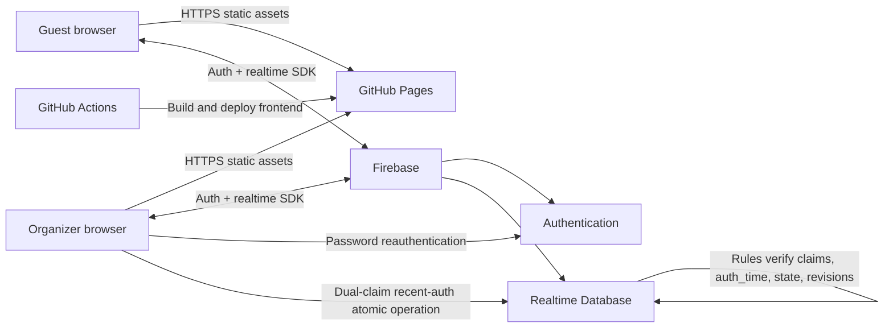
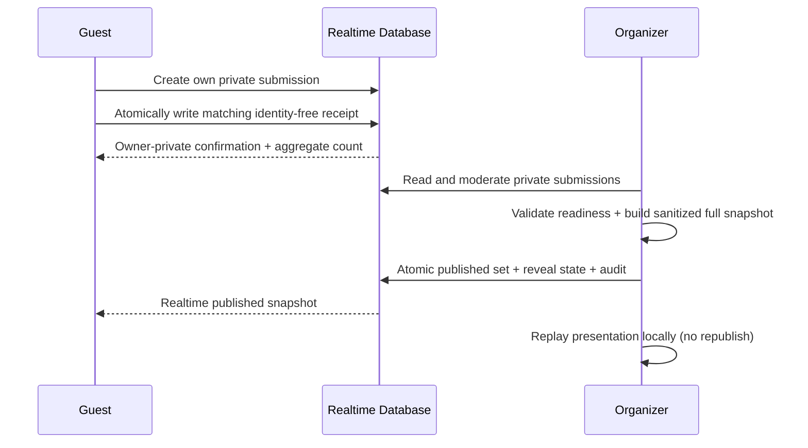

# Product specification

## 1. Product vision

Games & Castles is a private, mobile-first, one-page web experience for 31 July–2 August 2026 that keeps a group weekend understandable, competitive, and celebratory. Friday is a flexible game night in Germany, Saturday is the scheduled Prague Quest, and Sunday is departure and onward travel. It combines the calm editorial feel of a premium European travel journal with the energy of an arcade tournament. Connected devices share live competition results, standings, participant changes, predictions, and published reveals while organizers retain control over consequential actions.

The application is a static React frontend hosted on GitHub Pages. Firebase provides authentication, authorized realtime data, and Rules-enforced protected operations. GitHub Pages distributes inspectable client assets; it cannot protect content or grant authority. Phase 9 intentionally trusts the recently reauthenticated dual-claim reveal-organizer browser to derive aggregates while Rules independently enforce the write boundary.

### High-level architecture diagram

See [security-model.md](security-model.md) for trust boundaries and [data-model.md](data-model.md) for persisted state.

## 2. Users

| User | Description | Primary needs |
|---|---|---|
| Guest | A weekend participant authenticated anonymously on one device | Join, see plans and public state, play, submit messages and predictions, understand points |
| Organizer | A session-scoped signed-in user with `auth.token.admin === true` | Configure competitions, control results and locks, moderate content, trigger protected operations, recover from mistakes |
| Presenter | Usually an organizer using a shared display | Run full-screen reveals, brackets, podiums, and leaderboards without exposing controls |
| Reveal organizer | Organizer with `admin`, `specialRevealAdmin`, and recent password authentication | Publish protected data, resolve predictions, create idempotent ledger entries, write neutral audit records |
| Local fallback operator | Trusted Admin SDK credential stored outside the repository | Emergency inspection and recovery using the same deterministic domain logic |

Anonymous guests are not inherently anonymous to the application: each session has a Firebase UID and may be linked to one participant. A participant is a domain record; a Firebase user is an authenticated actor.

## 3. Primary use cases

### Guest

1. Open the page on a phone, sign in anonymously, and create or claim a participant profile as permitted.
2. Check the flexible Friday outline, scheduled Saturday itinerary, or Sunday departure summary.
3. Follow active matches, group/session progress, standings, and the overall leaderboard in realtime.
4. Inspect a point breakdown that explains every championship point.
5. Submit a Birthday Vault message without downloading anyone else's private submission.
6. Make or change one neutral prediction until the organizer locks the event.
7. Watch approved birthday messages and the special reveal after publication.
8. View protected trip information only when authenticated and authorized by the applicable rules.

### Organizer

1. Sign in for the browser session and enter organizer mode; inactivity signs Organizer Mode out after 30 minutes with a five-minute warning.
2. Manage participants and create a competition with a generic format and scoring configuration.
3. Preview and confirm generated fixtures/groups, then persist one shared order.
4. Start, record, correct, lock, and archive competitions; derived scores are recalculated on correction.
5. Review and moderate birthday submissions, then publish an approved snapshot.
6. Lock predictions, reauthenticate the current organizer account, confirm the action phrase, and execute the atomic reveal operation.
7. Review audit history and recover safely from stale or conflicting edits.

## 4. Experience model

The site is one vertically scrollable application with a sticky, compact navigation affordance and deep links to major sections. Critical state—active match, trip timing, synchronization failures, and organizer mode—must remain easy to reach without a desktop layout.

### 4.1 Hero

- Product title: **Games & Castles**.
- Complete trip range: **31 July–2 August 2026**, with the Germany-to-Prague context.
- A short playful tagline and subtle birthday acknowledgement.
- Prague/travel artwork or photography using the treatment defined in [design-system.md](design-system.md).
- Before play: a welcoming weekend summary. After scoring begins: current leader, tied-leader state where applicable, total points, and a link to the full breakdown.
- No sensitive reveal hints or exact accommodation address in copy, media filenames, metadata, or bundled data.

### 4.2 Weekend overview

Three day cards summarize the rhythm of the complete trip. Friday and Saturday are the two major activity cards; Sunday is a concise departure card that points to the confirmed Florenc departure board without implying additional activities or onward destinations.

**Friday, 31 July 2026 — Game Night in Germany** has no fixed times. It is an unordered activity pool that may contain console, board and card games, food and drinks, a birthday moment, free play, and championship events. The UI uses labels such as “Any order” or “Pick as we go” and must not imply a schedule.

**Saturday, 1 August 2026 — Prague Quest** links to the chronological timeline in section 5. It shows the 06:55 departure from Germany, the Prague arrival estimate, the next/high-priority item, the dinner reservation, and the cinema booking.

**Sunday, 2 August 2026 — Departure and onward travel** uses three confirmed groups: first by **08:50**, second by **09:00**, and third by **09:20**. Every group departs Prague from **Prague (Central Bus Station Florenc)**. The UI may present these as a compact departure board, but must not add group members, onward destinations, bookings, or other Sunday activities.

### 4.3 Live Championship

- Competition list with format label, status, participant count, and progress.
- Active competition and current/next match or session status.
- Format-appropriate standings and a knockout bracket where relevant.
- Overall top-three podium, full leaderboard, ties, recent points activity, per-participant point breakdown, and competition-specific breakdown.
- Organizer controls are gated both visually and by Firebase authorization; hiding a button is never the security boundary.
- Correction states must clearly show recalculation and the last confirmed result.

The internal formats and friendly labels are:

| Identifier | UI label |
|---|---|
| `round-robin-knockout` | Merry-Go-Round |
| `all-hands` | All Hands |
| `group-knockout` | Group Format |

Rules are normative in [game-rules.md](game-rules.md).

### 4.4 Saturday itinerary

The full timeline in section 5 is the approved source for Phase 1. Each entry includes its time, duration, place/activity, free status where applicable, transport or flexibility notes, and priority. The active time block may be highlighted using local device time, but the UI must label this as guidance rather than live navigation.

### 4.5 Birthday Vault

Before publication, the section presents a sealed guestbook. A linked guest can submit one message with an optional title, allowlisted motif, and named/anonymous display preference. Named identity comes from the participant profile rather than user-entered message data. After submission the guest sees their owner-private preview and an aggregate count derived from identity-free receipts. Other private messages and moderation must not be queried or delivered to the guest browser.

The organizer can read, approve/hide, order, close/reopen submissions before reveal, privately preview, and atomically publish a complete approved snapshot. Editing a message stales its earlier approval. Connected clients receive the sanitized published set in realtime. Presentation mode is full-screen, tasteful, keyboard accessible, reduced-motion safe, and replayable without rewriting publication data.

#### Birthday message publishing flow

Organizer authentication and strict Realtime Database Rules authorize and validate the bounded Phase 8 atomic operation because the organizer already has permission to read the source messages and no hidden outcome is involved. Section 4.6 adds a stronger role and recent-auth boundary for prediction resolution and the protected Special Reveal.

### 4.6 Special Reveal

The section uses neutral terminology and a neutral locked state. The organizer configures 2–8 choices whose stable stored identifiers are `option-a` through `option-h`; only identifiers present in the reviewed configuration are valid selections. User-facing labels are published dynamically with the opening. Each linked participant can submit one selection and can overwrite or withdraw it only while `prediction-open`. Other guests and ordinary organizer clients cannot read individual selections. An identity-free total may be shown before resolution; the option distribution publishes only with the final result.

The organizer first saves private configuration. Every sensitive lifecycle action then requires the current Firebase Email/Password credential, a force-refreshed token with `admin === true` and `specialRevealAdmin === true`, and a token `auth_time` no more than five minutes old. The browser clears the password, re-reads authoritative state, derives the sanitized result and deterministic source, then submits one root atomic update. Rules independently validate authorization, recent authentication, state/revision relationships, strict shapes, and configured point bounds. Correct predictions default to 3 championship points; incorrect or withdrawn predictions receive 0. Complete-source replacement makes retries, correction, and reconciliation idempotent.

The required organizer flow is:

1. Open organizer mode.
2. Save the reviewed private configuration.
3. Reauthenticate the designated reveal organizer, type `OPEN REVEAL`, and atomically open predictions.
4. Let linked guests submit one owner-private prediction while open.
5. Lock predictions; reopen only if further submissions are intentionally allowed.
6. Select the correct neutral option, reauthenticate, and type `RESOLVE PREDICTIONS`.
7. The browser verifies both claims/recent token state and derives the complete expected result from authoritative data.
8. Rules authorize one atomic update publishing only the selected resolution, identity-free aggregate, resolved state, deterministic source, and neutral audit.
9. Correct predictions receive configured championship points through one complete deterministic source.
10. All connected clients receive the new public state and leaderboard in realtime.
11. Correction requires the strong confirmation `CORRECT RESULT`; reconciliation never changes the selected public resolution.

No client asset, documentation example, path, component name, environment variable, or commit message may describe or hint at the sensitive content.

### 4.7 Trip information

- Saturday departure from Germany to Prague: **06:55**.
- Public accommodation area: **Žižkov, Prague 3**.
- Dinner: 18:00 at U Tří Prasátek (Three Piglets).
- Cinema: 20:00 at Cinema City Flora, original-language Spider-Man screening with Czech subtitles.
- Important transport, arrival, return, and group notes.
- The static application, mock data, and public documentation examples show only **Žižkov, Prague 3**. The exact accommodation address is not committed or bundled. A later authenticated implementation may retrieve it from restricted Firebase data, but it must never be backed by client-side data behind a cosmetic “Reveal address” control or written to logs, analytics, or source maps.

## 5. Approved Saturday itinerary

**Date:** Saturday, 1 August 2026  
**Departure from Germany:** 06:55 
**Expected arrival:** approximately 12:30 at Praha hlavní nádraží  
**Accommodation area:** Žižkov, Prague 3

All planned tourist attractions below are free. Dinner, cinema, and transport are bookings/journeys rather than free tourist attractions and must not be given a misleading free badge.

| Time | Activity | Required details | Priority/flexibility |
|---|---|---|---|
| 06:55 | Depart Germany for Prague | Begin the Saturday morning journey from Germany | Confirmed departure time |
| 12:30–13:15 | Arrival and luggage | Arrive at Prague Central Station; travel to accommodation; drop luggage | Arrival estimate; exact address protected |
| 13:15–14:00 | Army Museum Žižkov | Free admission; focused visit; prioritize World War I, creation of Czechoslovakia, Nazi occupation, World War II, reconstructed scenes, and major exhibits | First activity to shorten or skip after a delay; attraction priority 5 |
| 14:00–14:45 | Travel to Prague Castle | Walk to U Památníku; bus 207 to Staroměstská; Metro A to Malostranská; tram 22 to Pražský hrad | Route must be checked later against current conditions |
| 14:45–15:30 | Prague Castle grounds and gardens | Free exterior areas only; courtyards; St Vitus Cathedral exterior; South Garden viewpoints when accessible; photography | Attraction priority 1 |
| 15:30–15:50 | Old Castle Stairs descent | Historic staircase, downhill city views, photography; free | Attraction priority 8 |
| 15:50–16:20 | Wallenstein Garden | Grotto wall, peacocks, statues, pond, Sala Terrena; free admission | High-priority photography; attraction priority 4 |
| 16:20–17:05 | Malá Strana and Charles Bridge | Walk through Malá Strana; optional short Kampa detour; Charles Bridge; free | Charles Bridge is mandatory. Skip Kampa first if late; attraction priorities 6, 7, and 2 respectively |
| 17:05–17:30 | Old Town Square | Astronomical Clock exterior, Church of Our Lady before Týn exterior, Jan Hus Monument, general photography; free | Attraction priority 3 |
| 17:30–17:55 | Journey toward Flora | Metro journey with a small arrival buffer | Protect the 18:00 reservation |
| 18:00 | Dinner | Reservation at U Tří Prasátek / Three Piglets | Fixed booking |
| 20:00 | Cinema | Cinema City Flora; Spider-Man; original-language screening with Czech subtitles | Fixed booking |
| After film | Flexible return | Return to Žižkov; optional casual drink or walk | No mandatory scheduled activity |

### Attraction priority

1. Prague Castle grounds and views
2. Charles Bridge
3. Old Town Square
4. Wallenstein Garden
5. Army Museum Žižkov
6. Malá Strana
7. Kampa
8. Old Castle Stairs

Delay behavior must be explicit in the UI: shorten or skip the museum first; skip Kampa rather than reduce Charles Bridge time; protect fixed dinner and cinema bookings. This priority list assists group decisions but does not automatically rewrite the approved schedule.

## 6. Functional requirements

| ID | Requirement |
|---|---|
| FR-01 | Render all seven one-page sections with stable anchor navigation and mobile-first layouts. |
| FR-02 | Authenticate every writer; allow browser-local anonymous guest sign-in and browser-session organizer sign-in with idle expiry. |
| FR-03 | Link guest-owned writes to `auth.uid` and use participant IDs for domain references. |
| FR-04 | Subscribe to published competitions, standings, ledger-derived leaderboard views, participant list, counts, and reveal state in realtime. |
| FR-05 | Let organizers create and manage generic competitions using exactly the three supported format identifiers. |
| FR-06 | Persist confirmed fixture/group draws once; never silently regenerate them. |
| FR-07 | Validate and record format-appropriate results; corrections replace/recalculate derived entries. |
| FR-08 | Derive overall totals from individual immutable or superseding score ledger entries, never manual total increments. |
| FR-09 | Show each participant why points were awarded, including source and reason. |
| FR-10 | Accept private birthday submissions without granting guest read access to the private collection. |
| FR-11 | Publish only organizer-approved birthday content to a separate guest-readable path. |
| FR-12 | Accept one guest-owned prediction per linked participant and permit replacement only while open. |
| FR-13 | Lock and resolve the prediction event through recent dual-claim operations; use idempotent complete-source scoring. |
| FR-14 | Keep sensitive reveal content and exact accommodation details outside public assets and public database paths. |
| FR-15 | Provide organizer confirmations for destructive or irreversible actions and append audit entries. |
| FR-16 | Provide presentation modes that hide administrative controls and can replay animations without mutating state. |
| FR-17 | Display 31 July–2 August 2026 and the confirmed Friday/Saturday/Sunday roles, including the three Florenc departure groups, without inventing other Sunday itinerary details. |

## 7. Non-functional requirements

- **Performance:** target a usable initial shell on a typical mobile 4G connection; lazy-load noncritical imagery and presentation code; avoid large realtime root subscriptions.
- **Reliability:** all result and reveal operations are validated, idempotent where repeatable, and recoverable after reconnect. Persisted timestamps use server time.
- **Consistency:** one confirmed fixture order and result state is shared across devices. Derived views must include the revision/source version they represent.
- **Security/privacy:** default deny, least privilege, no test-mode rules, no client-side secrets, and separate development/production projects.
- **Maintainability:** discriminated TypeScript unions model formats; game names remain data; schema versions support migration.
- **Observability:** actionable failures and synchronization state are visible; privileged changes produce non-public audit records without sensitive payloads.
- **Browser support:** current evergreen mobile Safari and Chrome are primary; current desktop Safari, Chrome, Firefox, and Edge support organizer/presentation use.
- **Deployment:** deterministic Vite base-path configuration for GitHub Pages; public Firebase web configuration is not treated as secret merely because it is supplied through environment variables.

## 8. Accessibility requirements

- Meet WCAG 2.2 AA contrast and interaction expectations where practical.
- Use semantic landmarks and a logical heading hierarchy across the single page.
- All controls, dialogs, brackets, reveal modes, and organizer actions are keyboard operable with visible focus.
- Touch targets are at least 44 by 44 CSS pixels unless spacing provides an equivalent accessible target.
- Status is conveyed by text/icon/shape as well as color. Live updates use restrained, contextual announcements rather than repeatedly interrupting screen readers.
- Brackets have an equivalent ordered text/table representation; timelines use semantic lists and machine-readable times.
- Form fields have persistent labels, inline errors associated with fields, and a summary for failed administrative submission.
- Respect `prefers-reduced-motion`; presentation meaning never depends only on animation. Sound is optional, off by default, and has a visible control.

## 9. Mobile requirements

- Design from 320 CSS pixels upward, with no horizontal page scrolling.
- Keep itinerary essentials, active match actions, and score entry legible with one hand and outdoors.
- Use sticky controls sparingly so they do not cover content or browser chrome.
- Score entry must prevent accidental double submission and preserve unsubmitted local form values through transient UI rerenders.
- Wide brackets may use a focused round view or contained horizontal scroller with an accessible nonvisual alternative.
- Full-screen modes account for safe-area insets and device orientation; normal use must not require landscape.

## 10. Realtime, offline, and reconnect behavior

### Realtime

- Subscribe at the smallest practical public path and unsubscribe when a view is inactive.
- Realtime listeners update participant lists, confirmed fixtures/results, competition status, public standings/leaderboards, message count, and published reveal state.
- Optimistic display is allowed only for the guest's low-risk owned writes. Privileged actions show “Saving” until server acknowledgement.
- Every administrative record carries `updatedAt`, `updatedBy`, and a monotonically increasing `revision` or transaction precondition. A stale editor must reload or explicitly resolve the conflict.

### Offline

- Previously rendered public information may remain visible with a persistent “Offline — may be out of date” banner and last-successful-sync time.
- The static itinerary should remain available after the page has loaded. A service worker/PWA is deferred, so first-load offline support is not promised.
- Never show an administrative write as confirmed while offline. Do not queue reveal, lock, fixture regeneration, result correction, or publication actions for blind replay.
- A birthday message or unlocked prediction may be locally retained after a network error, but the UI must require an acknowledged retry and revalidate event status.

### Reconnect

1. Restore listeners and obtain authoritative server state.
2. Compare revisions before resubmitting any retained form.
3. Discard or flag a prediction draft if the event became locked.
4. Recompute/reload derived views after confirmed result changes.
5. Announce recovery without replaying celebration effects for historical events.

## 11. Out of scope for the first release

- Public registration, discovery, ticketing, payments, or social sharing.
- Native mobile apps, guaranteed first-load offline/PWA mode, and background push notifications.
- Chat, public photo uploads, live location tracking, and automatic transit rerouting.
- Hard-coded rules integrations for named commercial games.
- Spectator access without authentication or multi-weekend/league management.
- Rich achievement automation, sound-on-by-default, or uncontrolled effects.
- Guest self-service account recovery across devices; anonymous account linking is an open implementation decision.
- Automated adjudication of organizer-defined playoff/final tiebreak decisions.
- A detailed Sunday itinerary beyond the three confirmed Florenc departure groups and onward travel.

## 12. Release acceptance criteria

The first release is accepted when:

1. The seven sections show the complete 31 July–2 August 2026 trip range and exact approved Saturday itinerary on primary mobile browsers.
2. Friday is clearly flexible, Saturday is clearly scheduled with delay priorities and fixed bookings preserved, and Sunday shows only the three confirmed Florenc departure groups plus onward travel.
3. Guests and organizers authenticate and can perform only the actions allowed in [security-model.md](security-model.md).
4. All three generic formats can be configured without hard-coded game names; their identifiers match [game-rules.md](game-rules.md).
5. Confirmed draws are persisted, duplicate pairings are prevented, and regeneration is explicit and destructive.
6. Result correction yields the same standings and ledger as clean entry of the corrected result, with no duplicate points.
7. Overall totals equal the sum of active score entries and every point has a visible reason.
8. Private birthday messages and individual predictions are not downloaded to unauthorized guest devices.
9. Publication and special reveal flows update connected clients in realtime and are replayable visually without duplicate writes.
10. Repeated prediction resolution produces exactly one deterministic score entry per correct participant.
11. Public accommodation copy is exactly “Žižkov, Prague 3”; sensitive content and the exact accommodation address are absent from repository history, mock data, build output, public paths, logs, examples, and source maps.
12. Accessibility, reduced-motion, offline indicators, stale-write handling, and multi-device scenarios pass the tests defined in [implementation-roadmap.md](implementation-roadmap.md).
