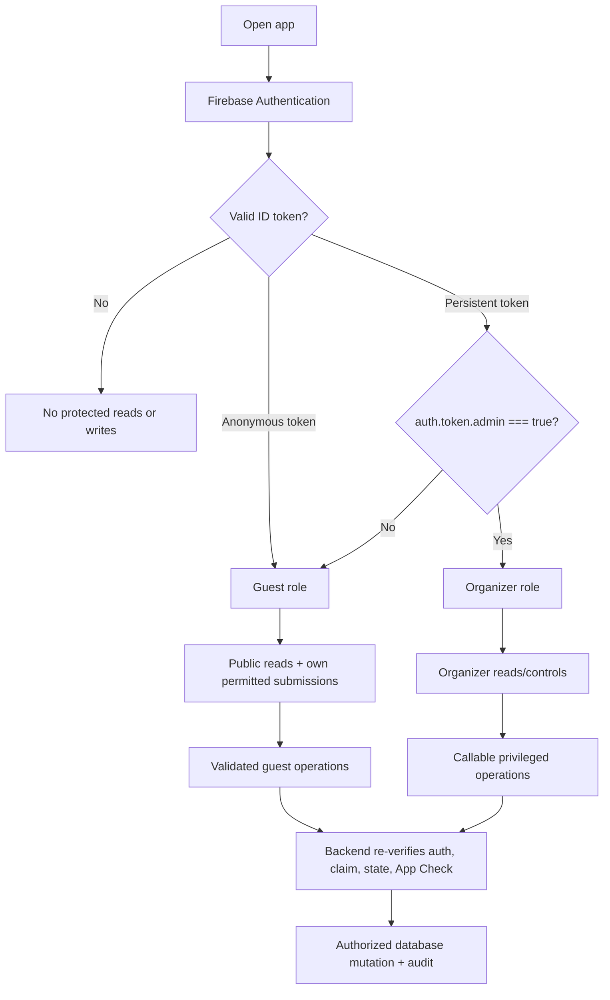

# Authentication and security model

## 1. Security goals and trust boundary

The frontend is untrusted. Every visitor can inspect JavaScript, network requests, DOM, styles, source maps, and Firebase configuration. GitHub Pages can host static assets but cannot protect a value, authorize an administrator, validate a result, or safely resolve a reveal.

Security is enforced by Firebase Authentication, default-deny Realtime Database Security Rules, App Check as defense in depth, and trusted Cloud Functions using the Admin SDK. Secret Manager or backend-only storage holds protected configuration. The client is responsible only for presentation, input collection, and invoking permitted operations.

### Protected assets

The following must never be committed, compiled by Vite, placed in public Firebase paths, emitted in logs/analytics, included in component/path names, or hinted at in documentation/commit messages:

- sensitive special-reveal content before publication;
- a protected organizer code or equivalent server-side condition;
- the exact accommodation address, which is excluded from static/public data and may be retrieved only by a later authenticated implementation from restricted storage;
- service-account credentials and private API credentials.

## 2. Authentication and role assignment

### Guests

- Use Firebase Anonymous Authentication so every write has a stable `auth.uid` for the device session.
- Link at most one active participant profile to a UID through a validated claim/create operation.
- Anonymous authentication is identity continuity, not proof of a real-world identity. Losing browser storage may create a new UID.
- Guest-visible display names and participant IDs never grant organizer powers.

### Organizers

- Use Firebase Email/Password Authentication in Phase 2, with no public sign-up or password-reset surface.
- Receive an `admin: true` Firebase custom claim through a separately controlled provisioning process using the Admin SDK.
- Every organizer authorization check is:

```text
auth != null && auth.token.admin === true
```

- The UI refreshes the ID token after claim provisioning/revocation, but backend/rules verification is authoritative.
- No database field such as `isAdmin`, email comparison in client code, URL parameter, or local-storage flag can grant access.
- Guest and organizer sessions use separate Firebase Auth instances so organizer sign-in/out cannot replace the same browser's anonymous UID.

### Phase 2 implemented boundary

Phase 2 permits narrowly scoped direct Realtime Database writes only for participant/profile onboarding, guest-owned display-field edits, and custom-claim organizer participant management. Rules reject deletes, unknown fields, guest status changes, immutable-field changes, unfiltered guest roster reads, and every unspecified path. Competition, score, message, prediction, reveal, audit, and protected-trip paths remain absent and denied.

Organizer accounts and custom claims are provisioned out of band with the Admin SDK utility documented in [Firebase setup](firebase-setup.md). That utility preserves unrelated custom claims, supports grant/revoke by email or UID, requires an explicit non-demo project ID, and never exposes credentials to Vite.

### User-role and permission flow



## 3. Permission matrix

“Guest” below means an authenticated anonymous or non-admin user. “Backend” means trusted Admin SDK code; the Admin SDK bypasses Rules, so functions must reproduce all application authorization and validation checks.

| Capability | Guest | Organizer | Backend |
|---|---:|---:|---:|
| Read safe itinerary/general trip info | Yes | Yes | Yes |
| Read exact restricted accommodation data | No | Only if a later authenticated feature authorizes it | Yes |
| Read published competitions, results, standings, leaderboard | Yes | Yes | Yes |
| Create own participant profile | Yes, validated | Yes | Yes |
| Manage other participants | No | Yes | Yes |
| Create/configure competitions and fixtures | No | Yes | Yes |
| Enter, correct, lock results | No | Yes | Yes |
| Write or modify score ledger | No | No direct client write | Yes |
| Submit birthday message | Yes, own validated submission | Yes | Yes |
| Read own private birthday submission | Optional own-only | Yes | Yes |
| Read another guest's private birthday submission | No | Yes | Yes |
| Moderate/publish birthday messages | No | Yes via protected operation | Yes |
| Submit/update own prediction while open | Yes | Yes for own prediction | Yes |
| Read another participant's private prediction before reveal | No | Organizer only when operationally required | Yes |
| Lock prediction event | No | Yes | Yes |
| Publish special reveal / resolve predictions | No | Invoke callable only | Yes |
| Read published reveal after publication | Yes | Yes | Yes |
| Read backend-only reveal/config/idempotency data | No | No client access | Yes |
| Read audit history | No | Yes | Yes |

Organizer capability to review predictions must not become a public aggregate or casual UI before reveal. If organizers do not need individual visibility, the UI should omit it even though the backend can read it.

## 4. Access rules strategy

### 4.1 Default deny

Never start from Firebase test mode. Test mode grants broad time-limited or public access and can expose private messages, predictions, protected trip data, or administrative writes. Production and development projects begin with root read/write denied; each allowed branch is intentionally opened.

Conceptual Rules structure (illustrative, not a deployable complete ruleset):

```json
{
  "rules": {
    ".read": false,
    ".write": false,
    "public": {
      ".read": "auth != null",
      ".write": false
    },
    "guestOwned": {
      "userProfiles": {
        "$uid": {
          ".read": "auth != null && (auth.uid === $uid || auth.token.admin === true)",
          ".write": "auth != null && auth.uid === $uid",
          ".validate": "newData.hasChildren(['schemaVersion','id','authKind','status'])"
        }
      },
      "birthdaySubmissions": {
        "$uid": {
          ".read": "auth != null && (auth.uid === $uid || auth.token.admin === true)",
          ".write": false
        }
      },
      "predictions": {
        "$eventId": {
          "$uid": {
            ".read": "auth != null && (auth.uid === $uid || auth.token.admin === true)",
            ".write": false
          }
        }
      }
    },
    "organizer": {
      ".read": "auth != null && auth.token.admin === true",
      ".write": "auth != null && auth.token.admin === true"
    },
    "backend": {
      ".read": false,
      ".write": false
    },
    "audit": {
      ".read": "auth != null && auth.token.admin === true",
      ".write": false
    }
  }
}
```

The recommended production design routes participant creation, birthday submission, prediction upsert, result mutation, publication, and resolution through callable functions. This enables cross-path checks, reliable server timestamps, rate limiting, audit, content-size validation, and idempotency. Semantic ownership remains reflected under `guestOwned`, but direct writes to high-risk branches are denied. If a low-risk direct-write implementation is temporarily used in development, it needs equivalent ownership, immutable-owner, event-status, field allowlist, size, and transition validation and must be replaced or explicitly threat-reviewed before production.

### 4.2 Validation rules

Every writable field is allowlisted. Validation includes:

- exact schema version and allowed enum strings;
- maximum UTF-8 lengths for names, titles, messages, reasons, and custom values;
- numeric bounds, finite integers where required, and array/map count limits;
- immutable IDs, owner UID, creator, creation timestamp, generation revision, and source keys;
- participant references exist and are active/eligible;
- prediction value is exactly `option-a` or `option-b` and event status is `open`;
- status transitions follow the lifecycle, not arbitrary strings;
- guests cannot set moderation, resolution, organizer, ledger, audit, or publication fields;
- organizer direct writes cannot reach `public`, `backend`, or ledger branches unless a narrowly scoped design explicitly allows it.

Rules must use `newData` and existing `data` to block ownership changes and deletes that evade validation. Indexes (`.indexOn`) are declared for supported bounded queries; the client never reads a whole private collection expecting to filter locally.

### 4.3 Public is not secret

The `/public` branch is readable by every authenticated guest. It may contain published scores, itinerary, safe participant display data, safe aggregate counts, and published reveal snapshots. Authentication reduces casual exposure but does not make content secret from group members.

## 5. Why client-side hiding is not protection

- Vite environment variables used by frontend code are substituted into shipped JavaScript. Prefix conventions control exposure to code; they do not encrypt a value.
- A PIN hard-coded or validated only in React can be found or bypassed in developer tools.
- Hidden CSS, conditional rendering, route guards, and obscure component names do not stop direct database/API calls or bundle inspection.
- A “Reveal address” button does not protect an address already present in HTML, JavaScript, a source map, static JSON, image metadata, or a public database response.
- Firebase web configuration identifies a project and is normally client-visible; Rules, Authentication, App Check, quotas, and backend validation provide security. It is still not a place for server credentials, and no fake credentials belong in documentation.

## 6. Protected operation design

### 6.1 Competition/result operations

Sensitive multi-record organizer actions use callable functions or equally trusted backend endpoints:

1. Verify Firebase ID token and `auth.token.admin === true`.
2. Verify App Check when enforcement is enabled.
3. Validate request schema, requested entity state, and `expectedRevision`.
4. Claim `requestId` for idempotency.
5. Derive official fixtures/results/standings/ledger changes on the backend or verify a deterministic preview input.
6. Commit the smallest atomic multi-location update possible.
7. Append a safe audit entry.
8. Return the accepted revision; never return backend-only protected payloads.

### 6.2 Birthday publication

Guest submission endpoints validate ownership, submission-open state, content length, and rate limits, then create a pending private record and update count through a trusted transaction/trigger. Organizer publication takes approved message IDs, re-reads them server-side, strips private fields and hidden entries, assigns a publication snapshot/order, writes only sanitized messages to `/public/birthday/publications`, updates reveal state, and audits. Clients replay animation using the existing `publicationId`; replay is not a write.

### 6.3 Prediction and special reveal

The following flow keeps prediction resolution and special-reveal publication inside the trusted backend.

```mermaid
sequenceDiagram
    participant G as Guest client
    participant O as Organizer client
    participant CF as Callable Cloud Function
    participant SM as Secret Manager / backend data
    participant DB as Realtime Database
    G->>CF: Upsert own option-a/option-b while open
    CF->>DB: Verify event open + owner; write one prediction
    O->>CF: Lock event (admin token, expected revision)
    CF->>DB: Transaction open -> locked + audit
    O->>CF: Confirm specialReveal + protected code + requestId
    CF->>CF: Verify ID token, admin claim, App Check, rate limit
    CF->>SM: Verify protected code/condition and load protected payload
    CF->>DB: Check locked state + idempotency request
    CF->>DB: Resolve predictions and upsert deterministic score keys
    CF->>DB: Publish sanitized reveal state/payload + audit
    DB-->>G: Realtime published state and updated leaderboard
```

The callable reveal operation must:

- accept only a neutral event/reveal ID, protected code when required, expected revision, and unique request ID;
- reject unauthenticated, non-admin, invalid-App-Check, rate-limited, unlocked, already-conflicting, or invalid-condition requests;
- compare a protected code against a server-side value without logging either value (use a timing-safe comparison where applicable);
- load prepublication content only after authorization from Secret Manager or a backend-only path;
- resolve selections server-side against the protected outcome;
- award the configured points (recommended 3) with `prediction:{eventId}:{participantId}` logical keys;
- write 0 no score entry for incorrect predictions (outcome may record `incorrect` privately);
- be idempotent: a repeat returns the existing publication/result and cannot award twice;
- publish only the sanitized content explicitly intended for all authenticated clients;
- avoid including sensitive content or codes in error text, audit summaries, traces, analytics, or function request logging.

Where one atomic Realtime Database update would exceed practical limits, store a backend-only operation state and make each step resumable/idempotent. Public state becomes `published` only after scores and publication data have reached a reconciled terminal state.

## 7. Exact accommodation-address privacy

The confirmed public/static policy is to show only **Žižkov, Prague 3**. The exact address must be absent from repository files, public documentation examples, mock data, static assets, build artifacts, precache, source maps, notification content, analytics, screenshots used in CI, and error reports. A cosmetic “Reveal address” control provides no security when client-side data already contains the value and is prohibited.

A later authenticated implementation may store the exact address under a restricted Firebase path such as `/organizer/protectedTripInfo/trip` or a separately authorized attendee branch. That future feature must define meaningful membership authorization before returning the value; possession of any anonymous token alone is insufficient. Until that feature is explicitly designed and reviewed, no exact address is stored or served by the application.

## 8. App Check, abuse controls, and rate limiting

App Check is enabled and monitored before enforcement, then enforced for Realtime Database, Authentication-supported flows where applicable, and Callable Functions in the hardening phase. It reduces abuse from non-genuine clients but does not replace Authentication, custom claims, Rules, or server validation.

Rate limits are backend-enforced for callable guest submission, prediction update, protected-code attempts, fixture regeneration, and reveal operations. Use hashed UID/IP/device-app identifiers as appropriate, short and long windows, and conservative retry responses. Never store the protected code as a rate-limit key. Examples of policy to confirm through rehearsal:

- birthday submission: small per-UID count plus burst cooldown;
- prediction update: modest per-UID burst limit while open;
- protected-code verification: very low per-admin/per-project attempt rate with alerting;
- result mutation: high enough for normal play, guarded by revision/idempotency rather than only frequency.

Rules enforce hard structural ceilings even when functions rate-limit: maximum record counts per owned branch, allowed field sizes, and no guest deletes/rewrites outside policy. Firebase quotas and budget alerts provide an additional containment layer.

## 9. Audit logging

Audit logs are organizer-readable and append-only from trusted operations. Log actor UID/role, action, entity and safe revision metadata, timestamp, request ID, reason, and outcome. Do not log message bodies, prediction selections unless strictly required, exact addresses, protected codes, secret comparisons, prepublication payloads, access tokens, or full function inputs.

High-value audited actions include admin claim provisioning/revocation, participant management, draw confirmation/reset, result correction/reopen/lock, scoring configuration change, birthday moderation/publication, prediction lock/reopen, reveal attempts/outcome, protected-address access-policy changes, and data export/deletion.

## 10. Multi-admin concurrency

- Administrative records carry monotonically increasing `revision`; operations require `expectedRevision`.
- Realtime Database transactions or backend compares ensure only one writer advances a revision.
- A stale client receives a conflict with the current safe revision and must reload; it never silently wins by last write.
- Destructive resets acquire an operation lock/lease with expiry and idempotent request ID.
- Reveal and prediction locking are state-machine transitions. Only one transition can claim the prior state.
- Audit and operation records make partial failure diagnosable. Locks have backend-owned expiry/recovery, not a client-clearable boolean.
- Organizer UI displays who last updated state and when, but security never depends on presence indicators.

## 11. Environments and secrets

Use separate Firebase projects for development and production, with different databases, Auth users/providers, custom claims, App Check registrations, function deployments, Secret Manager values, quotas, and audit data. Emulator tests use synthetic content only.

GitHub Actions receives only the deployment credentials it needs through GitHub encrypted secrets or workload identity where supported. Vite build variables may contain public project configuration but never service-account JSON, protected codes, exact addresses, or prepublication content. Production deploy review includes searching the built output and source maps for forbidden sensitive terms/data.

Secrets are provisioned out of band into Google Cloud Secret Manager. Access is restricted to the specific function service account; versions rotate without a frontend rebuild. Local development uses emulator-safe dummy values held outside tracked files.

## 12. Security Rules emulator testing

Rules are version-controlled and tested in the Firebase Emulator Suite before deployment. Minimum test matrix:

| Scenario | Expected result |
|---|---|
| Unauthenticated read of any default path | Denied |
| Guest read of safe public itinerary/competition/leaderboard | Allowed |
| Guest write to public competition/result/ledger/audit | Denied |
| Guest create/update another UID's profile/submission/prediction | Denied |
| Guest enumerate private birthday submissions or predictions | Denied |
| Guest submit invalid enum, oversized content, forged owner, moderation/outcome field | Denied/rejected by callable |
| Guest change prediction after lock | Denied even with stale client state |
| Non-admin persistent user access organizer branch/callable | Denied |
| Admin read organizer and audit branches | Allowed |
| Admin direct read backend-only secret/idempotency branch | Denied to client |
| Admin callable with stale revision | Conflict; no partial write |
| Repeated reveal request ID | Same terminal response; no extra score entries |
| Correct prediction replay with new request ID after resolved | No duplicate deterministic score key |
| Public read of locked special reveal | Neutral locked state only |
| Exact address through public paths/build test fixture | Absent |

Tests also cover deletes, partial updates, unknown child fields, null transitions, query indexes, archived records, token claim absence/false/true, claim revocation after token refresh, and concurrent emulator transactions.

## 13. Hardening checklist

- Default-deny Rules deployed before data is written; test mode never enabled.
- Authorized domains, Auth providers, and admin accounts minimized.
- Custom claim provisioning is out-of-band and audited.
- Callable functions validate Auth, admin claim where required, App Check, request schema, state, revision, and idempotency.
- Secret Manager IAM restricted to required function service accounts.
- Public database and built assets automatically scanned for forbidden protected data.
- App Check enforcement, rate limits, quotas, budget alerts, and function alerts enabled after monitoring.
- Dependency and GitHub Actions pinning/review performed in implementation phases.
- Production data backup/export and tested recovery procedure exist before the weekend.
- Organizer accounts use strong provider security; no shared frontend PIN is treated as authentication.
