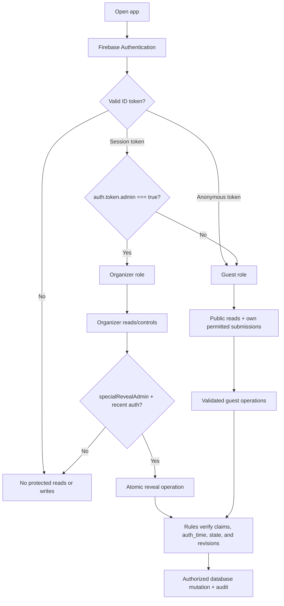
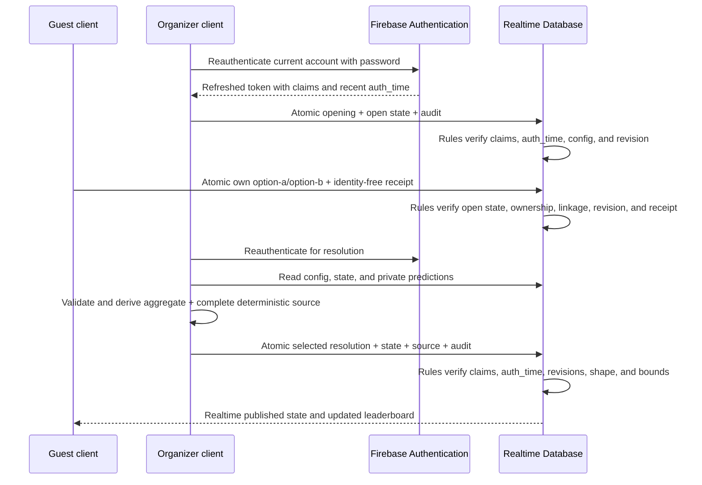

# Authentication and security model

## 1. Security goals and trust boundary

The frontend is inspectable. Every visitor can inspect JavaScript, network requests, DOM, styles, and Firebase configuration. Production source maps are disabled, but GitHub Pages still cannot protect a value or grant authority. Firebase Authentication proves organizer identity and recent password authentication, while Realtime Database Rules authorize the exact read/write boundary and validate the strongest practical invariants.

Security is enforced by Firebase Authentication and default-deny Realtime Database Security Rules. Phase 10 can stage App Check on both clients as optional defense in depth, but enforcement remains off and App Check never replaces claims, recent authentication, or Rules. Protected reveal configuration remains in claim-restricted Realtime Database data. The privileged reveal-organizer browser performs aggregate calculation and atomic writes only after password reauthentication; trusted local Admin SDK tools exist for bounded emergency/backup/cleanup operations.

### Protected assets

The following must never be committed, compiled by Vite, placed in public Firebase paths, emitted in logs/analytics, included in component/path names, or hinted at in documentation/commit messages:

- sensitive special-reveal content before publication;
- organizer passwords or other authentication credentials;
- the exact accommodation address, which is excluded from static/public data and may be retrieved only by a later authenticated implementation from restricted storage;
- service-account credentials and private API credentials.

## 2. Authentication and role assignment

### Guests

- Use Firebase Anonymous Authentication so every write has a stable `auth.uid` for the device session.
- Link at most one active participant profile to a UID through a validated claim/create operation.
- Anonymous authentication is identity continuity, not proof of a real-world identity. Losing browser storage may create a new UID.
- Guest-visible display names and participant IDs never grant organizer powers.

### Organizers

- Use Firebase Email/Password Authentication in Phase 2, with no public sign-up or password-reset surface.
- Receive an `admin: true` Firebase custom claim through a separately controlled provisioning process using the Admin SDK.
- The designated reveal organizer additionally receives `specialRevealAdmin: true`; ordinary admins do not gain reveal-private access.
- Every organizer authorization check is:

```text
auth != null && auth.token.admin === true
```

- The UI refreshes the ID token after claim provisioning/revocation, but Authentication and Rules verification is authoritative.
- No database field such as `isAdmin`, email comparison in client code, URL parameter, or local-storage flag can grant access.
- Guest and organizer sessions use separate Firebase Auth instances so organizer sign-in/out cannot replace the same browser's anonymous UID.
- Guest identity uses local persistence; organizer identity uses browser-session persistence and a 30-minute activity deadline with a warning for the final five minutes. Supported tabs exchange activity/expiry signals through `BroadcastChannel`.

### Phase 2–10 implemented boundary

Phase 2 permits narrowly scoped direct Realtime Database writes for participant/profile onboarding, guest-owned display-field edits, and custom-claim organizer participant management. Phase 3 additionally permits claim-authorized organizer writes to `/competitionDrafts`, `/competitions`, and append-only `/audit`. Phases 4–6 open authenticated read-only access to `/competitionRuns` and claim-authorized organizer writes for exact `round-robin-knockout`, `all-hands`, and `group-knockout` runtimes. The guest UI selects `scheduled`, `active`, and `completed` records; archived records contain no private payload and remain omitted.

Competition Rules validate exact enums and schemas, conservative field/index/score bounds, immutable creation/publication/activation metadata, legal lifecycle transitions, and one-step runtime/match/session/result revisions. Phase 7 adds a bounded admin-claim client exception for complete competition-ledger sources and manual bonuses. Phase 8 adds a separately bounded Birthday Vault exception: an owner may atomically update only their UID-keyed message and matching identity-free receipt while collecting; an organizer may moderate and change lifecycle state. Phase 10 strengthens sanitized full-set reveal/republish with recent password authentication. Phase 9 adds one owner-scoped prediction plus identity-free receipt write while `prediction-open`. A recently password-reauthenticated user with both `admin` and `specialRevealAdmin` may read all predictions and atomically publish reveal state, the selected resolution, and the complete prediction-ledger source. Direct writes remain denied for persisted totals, protected trip data, ordinary admins, stale sensitive sessions, and every unspecified path.

Organizer accounts and custom claims are provisioned out of band with the Admin SDK utility documented in [Firebase setup](firebase-setup.md). That utility preserves unrelated custom claims, supports grant/revoke by email or UID, requires an explicit non-demo project ID, and never exposes credentials to Vite.

### User-role and permission flow



## 3. Permission matrix

“Guest” below means an authenticated anonymous or non-admin user. “Reveal organizer” means a dual-claim organizer with recent password authentication for sensitive actions. “Local fallback” means trusted Admin SDK code; it bypasses Rules and therefore reuses the same validation and derivation helpers before writing.

| Capability | Guest | Organizer | Reveal organizer / local fallback |
|---|---:|---:|---:|
| Read safe itinerary/general trip info | Yes | Yes | Yes |
| Read exact restricted accommodation data | No | Only if a later authenticated feature authorizes it | Yes |
| Read published competitions, results, standings, leaderboard | Yes | Yes | Yes |
| Create own participant profile | Yes, validated | Yes | Yes |
| Manage other participants | No | Yes | Yes |
| Create/configure competition drafts and scheduled records | No | Yes, Phase 3 Rules validated | Yes |
| Generate/confirm fixtures, groups, or sessions | No | Yes for Merry-Go-Round, All Hands, and Group Format under format-specific Rules/revisions | Yes |
| Enter, correct, complete, or reopen results | No | Yes for all three implemented formats under format-specific Rules/revisions | Yes |
| Replace/reconcile a complete competition source | No | Yes, bounded Phase 7 Rules; no individual-entry edit | Yes |
| Create/revoke/restore manual bonus | No | Yes, bounded Phase 7 Rules/revisions | Yes |
| Submit birthday message | Yes, own validated submission | Yes | Yes |
| Read own private birthday submission | Optional own-only | Yes | Yes |
| Read another guest's private birthday submission | No | Yes | Yes |
| Moderate/publish birthday messages | No | Yes, bounded Phase 8 Rules and atomic full-set operation | Yes |
| Submit/update own prediction while open | Yes | Yes for own prediction | Yes |
| Read another participant's private prediction before reveal | No | No | Yes, recent auth / trusted local credential |
| Lock prediction event | No | No for ordinary admin | Yes, recent auth / trusted local credential |
| Publish special reveal / resolve predictions | No | No for ordinary admin | Yes, recent auth / trusted local credential |
| Read published reveal after publication | Yes | Yes | Yes |
| Read private reveal configuration | No | No for ordinary admin | Yes |
| Read audit history | No | Yes | Yes |

The organizer UI has no casual individual-prediction view. Before resolution, authenticated guests receive only identity-free active receipts for counting; the option distribution is published only with the atomic resolution.

## 4. Access rules strategy

### 4.1 Default deny

Never start from Firebase test mode. Test mode grants broad time-limited or public access and can expose private messages, predictions, protected trip data, or administrative writes. Production and development projects begin with root read/write denied; each allowed branch is intentionally opened.

Conceptual Rules structure (illustrative, not a deployable complete ruleset):

```json
{
  "rules": {
    ".read": false,
    ".write": false,
    "public": {
      ".read": "auth != null",
      ".write": false
    },
    "guestOwned": {
      "userProfiles": {
        "$uid": {
          ".read": "auth != null && (auth.uid === $uid || auth.token.admin === true)",
          ".write": "auth != null && auth.uid === $uid",
          ".validate": "newData.hasChildren(['schemaVersion','id','authKind','status'])"
        }
      },
      "birthdaySubmissions": {
        "$uid": {
          ".read": "auth != null && (auth.uid === $uid || auth.token.admin === true)",
          ".write": false
        }
      },
      "predictions": {
        "$eventId": {
          "$uid": {
            ".read": "auth != null && (auth.uid === $uid || auth.token.admin === true)",
            ".write": false
          }
        }
      }
    },
    "organizer": {
      ".read": "auth != null && auth.token.admin === true",
      ".write": "auth != null && auth.token.admin === true"
    },
    "audit": {
      ".read": "auth != null && auth.token.admin === true",
      ".write": false
    }
  }
}
```

Direct client writes are allowed only when authority and the strongest practical validation inputs are Rules-visible and the decision register explicitly records the boundary. Phase 8 Birthday Vault is one such boundary: ownership, participant linkage, lifecycle, immutable IDs, revisions, receipt coupling, admin claim, and sanitized publication shape are Rules-verifiable; readiness checks requiring collection-wide analysis also run in the organizer client and block publication. Phase 9 accepts the additional limitation that aggregate calculation is inspectable and performed by the specially authorized organizer browser.

Phases 4–6 use this boundary for public-safe competition execution data. Phase 7 extends it to one complete derived ledger source per run. Phase 8 adds owner-scoped Birthday Vault submission and organizer publication. Phase 9 adds owner-scoped prediction/receipt updates while open and recent dual-claim browser operations for opening, lifecycle changes, resolution, correction, and reconciliation. Each operation uses the smallest root-level atomic update, exact schemas, and one-step revisions; no repository method exposes a private collection to ordinary guests/admins or incrementally appends published messages or points.

### 4.2 Validation rules

Every writable field is allowlisted. Validation includes:

- exact schema version and allowed enum strings;
- maximum UTF-8 lengths for names, titles, messages, reasons, and custom values;
- numeric bounds, finite integers where required, and array/map count limits;
- immutable IDs, owner UID, creator, creation timestamp, generation revision, and source keys;
- participant references exist and are active/eligible;
- prediction value is exactly `option-a` or `option-b` and event status is `open`;
- status transitions follow the lifecycle, not arbitrary strings;
- guests cannot set moderation, resolution, organizer, ledger, audit, or publication fields;
- organizer direct writes reach only the exact phase branches and transitions explicitly allowlisted by Rules; protected reveal writes additionally require both claims and recent `auth_time`.

Rules must use `newData` and existing `data` to block ownership changes and deletes that evade validation. Indexes (`.indexOn`) are declared for supported bounded queries; the client never reads a whole private collection expecting to filter locally.

### 4.3 Public is not secret

The `/public` branch is readable by every authenticated guest. It may contain published scores, itinerary, safe participant display data, safe aggregate counts, and published reveal snapshots. The static Sunday departure board—three times and Prague (Central Bus Station Florenc)—is intentionally public-safe and requires no protected path. Authentication reduces casual exposure but does not make content secret from group members.

## 5. Why client-side hiding is not protection

- Vite environment variables used by frontend code are substituted into shipped JavaScript. Prefix conventions control exposure to code; they do not encrypt a value.
- A PIN hard-coded or validated only in React can be found or bypassed in developer tools.
- Hidden CSS, conditional rendering, route guards, and obscure component names do not stop direct database/API calls or bundle inspection.
- A “Reveal address” button does not protect an address already present in HTML, JavaScript, a source map, static JSON, image metadata, or a public database response.
- Firebase web configuration identifies a project and is normally client-visible; Rules, Authentication, App Check, and quotas provide security. It is still not a place for privileged credentials, and no fake credentials belong in documentation.

## 6. Protected operation design

### 6.1 Competition/result operations

Competition operations use admin-claim checks, structural/state validation, revision compare-and-set, atomic fan-out, and append-only audit in Realtime Database Rules. The client derives deterministic previews and complete source replacements; Rules enforce the authorized paths, legal transitions, and source/run relationships.

### 6.2 Birthday publication

Phase 8 uses a Rules-validated client operation. A guest atomic update writes `/birthdayVault/privateMessages/{auth.uid}` and the receipt at the message's immutable UUID. Rules require a collecting vault, owner/profile/participant linkage, immutable identity, valid content, one-step revision, and matching receipt state/timestamp. Authenticated guests may read receipts for counting but receive no identity or content through them.

An authorized organizer reads the private and moderation collections, verifies the current expected revisions and reveal-readiness checklist, and derives a complete sanitized snapshot. Immediately before reveal/republish, the organizer re-enters the current Firebase password; the password is cleared before any database access. One root update replaces `/birthdayVault/publishedMessages`, advances `/birthdayVault/publicState`, and appends safe audit metadata. Rules require the admin claim, a five-minute `auth_time`, legal state/reveal revisions, valid anonymous/named published shapes, and the post-write revealed state. Anonymous records omit participant and owner identity. Realtime Database Rules cannot quantify arbitrary sibling collections or map an opaque publication UUID back through a UID-keyed private collection; pending/stale/duplicate/order readiness is therefore also enforced by strict runtime validation and covered by domain/frontend tests.

### 6.3 Prediction and special reveal

Phase 9 uses a deliberately scoped, browser-first privileged operation. The organizer must have `admin === true` and `specialRevealAdmin === true`, re-enter the password for the current Firebase Email/Password account, force-refresh the ID token, and act within five minutes of its `auth_time`. The password is cleared before any database operation. Rules independently enforce both claims and recent authentication for sensitive reads and writes.



The implemented boundary:

- accepts only the expected state/config/resolution revisions and an `option-a` / `option-b` choice for resolution/correction;
- blocks ordinary admins, stale sessions, malformed transitions, conflicting revisions, and arbitrary point values;
- stores both possible payloads only in dual-claim private configuration, frozen after opening, and publishes only the reviewed opening or selected resolution fields;
- resolves valid submitted predictions in the privileged browser and replaces one complete deterministic source whose logical identity is `prediction:{eventId}:{participantId}`;
- writes no entry for incorrect/withdrawn predictions and cannot append duplicate points on retry;
- uses one root atomic update for the resolution/correction state, selected payload, complete source, and neutral audit metadata;
- supports typed-confirmation correction and deterministic damaged-source reconciliation without changing the public outcome during reconciliation.

This does not make the browser equivalent to a private server. The calculation procedure is inspectable, the reveal-admin browser can read private predictions, and a compromised reveal-admin account or unlocked laptop is privileged. Rules cannot practically recompute every aggregate, so they validate authorization, recent authentication, revisions, relationships, strict shapes, and bounded configured values. The emergency local Admin SDK tool is the stronger-trust recovery path. Optional staged App Check does not change that trust boundary.

## 7. Exact accommodation-address privacy

The confirmed public/static policy is to show only **Žižkov, Prague 3**. The exact address must be absent from repository files, public documentation examples, mock data, static assets, build artifacts, precache, source maps, notification content, analytics, screenshots used in CI, and error reports. A cosmetic “Reveal address” control provides no security when client-side data already contains the value and is prohibited.

A later authenticated implementation may store the exact address under a restricted Firebase path such as `/organizer/protectedTripInfo/trip` or a separately authorized attendee branch. That future feature must define meaningful membership authorization before returning the value; possession of any anonymous token alone is insufficient. Until that feature is explicitly designed and reviewed, no exact address is stored or served by the application.

## 8. App Check and abuse controls

Phase 10 supports optional `ReCaptchaEnterpriseProvider` initialization for the guest and organizer Firebase apps. It is disabled by default, rejects production debug mode, reports only token availability, and degrades without blocking the static page while enforcement is off. The repository never stores a debug token. Firebase Console enforcement cannot be read from the browser and is reported as unknown.

App Check may reduce abuse from non-genuine clients but does not replace Authentication, custom claims, password reauthentication, Rules, quotas, or operational review. Because Enterprise assessments can exceed a no-cost quota, remote registration/monitoring is permitted only when available without billing or paid API activation. Enforcement requires a separate device-tested zero-cost decision; Phase 10 does not enable it. There is no custom app-specific credential or pretend browser rate limiter. Rules continue to enforce structural ceilings, allowed field sizes, lifecycle boundaries, and no guest rewrites outside policy.

## 9. Audit logging

Audit logs are organizer-readable and append-only from authorized operations. Log actor UID/role, action, entity and safe revision metadata, timestamp, request ID, reason, and outcome. Do not log passwords, message bodies, individual prediction selections, exact addresses, prepublication payloads, access tokens, service-account details, or full operation inputs.

High-value audited actions include admin claim provisioning/revocation, participant management, draw confirmation/reset, result correction/reopen/lock, scoring configuration change, birthday moderation/publication, prediction lock/reopen, reveal attempts/outcome, protected-address access-policy changes, and data export/deletion.

## 10. Multi-admin concurrency

- Administrative records carry monotonically increasing `revision`; operations require `expectedRevision`.
- Realtime Database Rules compare current and post-write data so only one writer advances a revision.
- A stale client receives a conflict with the current safe revision and must reload; it never silently wins by last write.
- Destructive competition resets follow their documented revision and lifecycle policy.
- Reveal and prediction locking are state-machine transitions. Only one transition can claim the prior state.
- Root-level multi-location updates prevent partial publication; audit and operation records make rejected/stale actions diagnosable.
- Organizer UI displays who last updated state and when, but security never depends on presence indicators.

## 11. Environments and secrets

Use separate Firebase projects for development and production, with different databases, Auth users/providers, custom claims, App Check registrations, quotas, and audit data. Emulator tests use synthetic content only.

GitHub Actions receives only public Firebase web configuration through repository variables. Vite build variables may contain public project configuration but never service-account JSON, organizer passwords, exact addresses, or prepublication content. Production deploy review includes searching the built output and source maps for forbidden sensitive terms/data.

Trusted local Admin SDK tools use `GOOGLE_APPLICATION_CREDENTIALS` pointing to a mode-`600` file outside the repository. They parse its `project_id`, reject a target mismatch, require an exact repeated remote project ID, and separate `demo-*` emulator use from remote use. They never run in CI or Pages deployment. There is no app-specific reveal credential in source, Firebase, environment variables, GitHub configuration, or Rules.

## 12. Security Rules emulator testing

Rules are version-controlled and tested in the Firebase Emulator Suite before deployment. Minimum test matrix:

| Scenario | Expected result |
|---|---|
| Unauthenticated read of any default path | Denied |
| Guest read of safe public itinerary/competition/leaderboard | Allowed |
| Guest write to public competition/result/ledger/bonus/audit | Denied |
| Guest create/update another UID's profile/submission/prediction | Denied |
| Guest enumerate private birthday submissions or predictions | Denied |
| Guest submit invalid enum, oversized content, forged owner, moderation/outcome field | Denied by Rules |
| Guest change prediction after lock | Denied even with stale client state |
| Non-admin session user access organizer branch | Denied |
| Admin read organizer and audit branches | Allowed |
| Ordinary admin read private reveal config/all predictions | Denied |
| Dual-claim reveal admin with old `auth_time` | Sensitive read/write denied |
| Recently reauthenticated dual-claim reveal admin | Legal operation allowed |
| Admin with old `auth_time` reveals/republishes Birthday Vault | Denied |
| Recently reauthenticated admin publishes valid Birthday snapshot | Allowed |
| Reveal operation with stale revision | Denied; no partial write |
| Repeated matching reveal/correction | Terminal no-op; no extra score entries |
| Reconciliation against matching source | No write; deterministic score key remains single |
| Public read of locked special reveal | Neutral locked state only |
| Exact address through public paths/build test fixture | Absent |

Tests also cover deletes, partial updates, unknown child fields, null transitions, query indexes, archived records, token claim absence/false/true, claim revocation after token refresh, and concurrent emulator transactions.

The expanded Phase 2–10 Rules matrix preserves all participant, configuration, competition-runtime, ledger, bonus, Birthday Vault, and Special Reveal regressions. It covers claim absence/roles, recent/expired `auth_time`, private configuration, owner isolation, lifecycle/publication, resolved-only prediction sources, audit, strict schemas, deterministic point constraints, recent-auth Birthday publication, and default denial. Platform-neutral domain and frontend tests cover reauthentication ordering/password clearing, strict state/revision boundaries, aggregate calculation, resolution/correction, deterministic scoring, damaged-source reconciliation, and no-op retry. Production deployment remains a separately authorized operator action and is never performed by the Pages workflow.

## 13. Hardening checklist

- Default-deny Rules deployed before data is written; test mode never enabled.
- Authorized domains, Auth providers, and admin accounts minimized.
- Custom claim provisioning is out-of-band and audited.
- Reveal controls require `admin`, `specialRevealAdmin`, Firebase password reauthentication, token refresh, and the Rules-enforced five-minute `auth_time` window; Birthday publication requires the corresponding admin recent-auth boundary.
- Ordinary admins cannot read private reveal configuration, enumerate predictions, or write reveal lifecycle/source paths.
- Tracked files and built assets are scanned for high-confidence credentials and ignored local forbidden terms.
- App Check stays disabled or enforcement-off during staging; future enforcement follows legitimate-device monitoring and a separate rollback decision.
- Dependencies are audited; official Actions use verified SHA pins and Dependabot review.
- Encrypted backup/inspection and dry-run-first private cleanup are rehearsed before the weekend; automated live restore remains deliberately absent.
- Organizer accounts use strong provider security; typed confirmation phrases are never treated as authentication.
- The local Admin SDK fallback credential remains outside the repository and is used only by a trusted operator.
