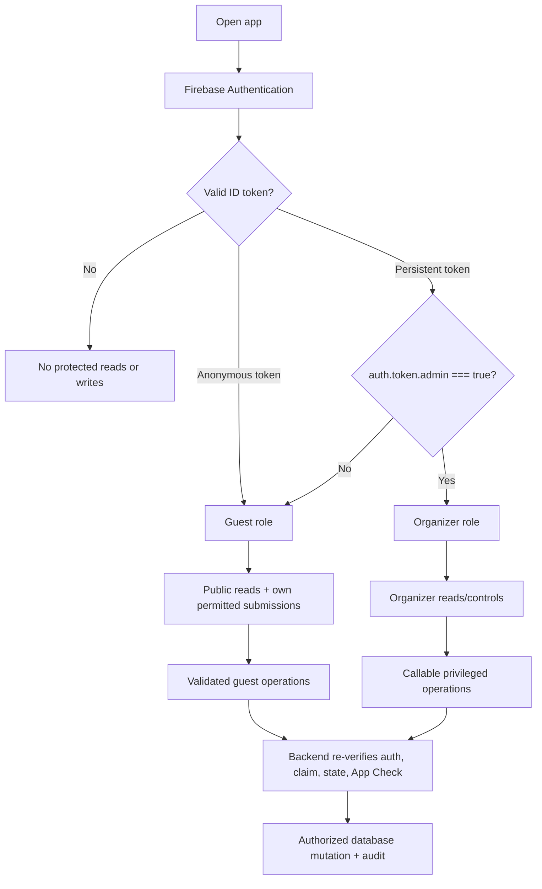
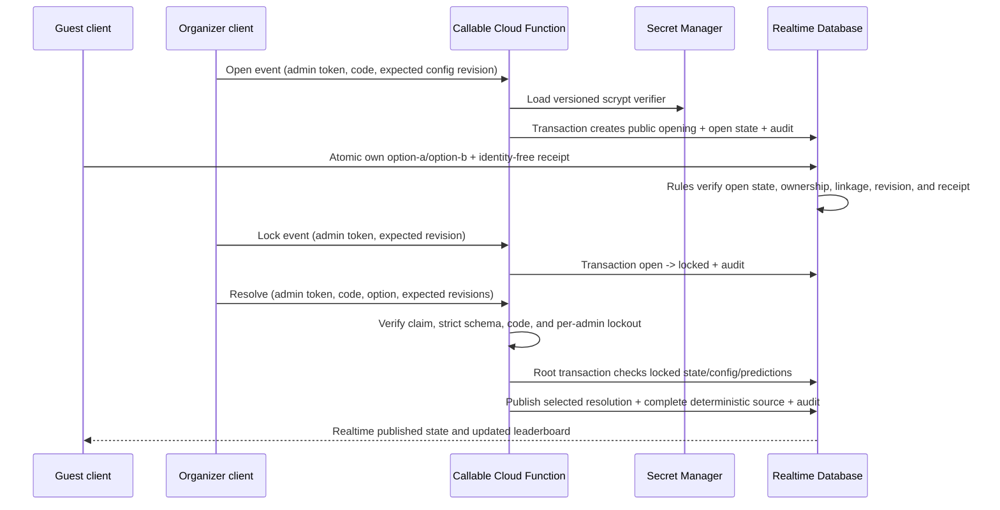

# Authentication and security model

## 1. Security goals and trust boundary

The frontend is untrusted. Every visitor can inspect JavaScript, network requests, DOM, styles, source maps, and Firebase configuration. GitHub Pages can host static assets but cannot protect a value, authorize an administrator, validate a result, or safely resolve a reveal.

Security is enforced by Firebase Authentication, default-deny Realtime Database Security Rules, App Check as defense in depth, and trusted Cloud Functions using the Admin SDK. Secret Manager or backend-only storage holds protected configuration. The client is responsible only for presentation, input collection, and invoking permitted operations.

### Protected assets

The following must never be committed, compiled by Vite, placed in public Firebase paths, emitted in logs/analytics, included in component/path names, or hinted at in documentation/commit messages:

- sensitive special-reveal content before publication;
- a protected organizer code or equivalent server-side condition;
- the exact accommodation address, which is excluded from static/public data and may be retrieved only by a later authenticated implementation from restricted storage;
- service-account credentials and private API credentials.

## 2. Authentication and role assignment

### Guests

- Use Firebase Anonymous Authentication so every write has a stable `auth.uid` for the device session.
- Link at most one active participant profile to a UID through a validated claim/create operation.
- Anonymous authentication is identity continuity, not proof of a real-world identity. Losing browser storage may create a new UID.
- Guest-visible display names and participant IDs never grant organizer powers.

### Organizers

- Use Firebase Email/Password Authentication in Phase 2, with no public sign-up or password-reset surface.
- Receive an `admin: true` Firebase custom claim through a separately controlled provisioning process using the Admin SDK.
- Every organizer authorization check is:

```text
auth != null && auth.token.admin === true
```

- The UI refreshes the ID token after claim provisioning/revocation, but backend/rules verification is authoritative.
- No database field such as `isAdmin`, email comparison in client code, URL parameter, or local-storage flag can grant access.
- Guest and organizer sessions use separate Firebase Auth instances so organizer sign-in/out cannot replace the same browser's anonymous UID.

### Phase 2–9 implemented boundary

Phase 2 permits narrowly scoped direct Realtime Database writes for participant/profile onboarding, guest-owned display-field edits, and custom-claim organizer participant management. Phase 3 additionally permits claim-authorized organizer writes to `/competitionDrafts`, `/competitions`, and append-only `/audit`. Phases 4–6 open authenticated read-only access to `/competitionRuns` and claim-authorized organizer writes for exact `round-robin-knockout`, `all-hands`, and `group-knockout` runtimes. The guest UI selects `scheduled`, `active`, and `completed` records; archived records contain no private payload and remain omitted.

Competition Rules validate exact enums and schemas, conservative field/index/score bounds, immutable creation/publication/activation metadata, legal lifecycle transitions, and one-step runtime/match/session/result revisions. Phase 7 adds a bounded admin-claim client exception for complete competition-ledger sources and manual bonuses. Phase 8 adds a separately bounded Birthday Vault exception: an owner may atomically update only their UID-keyed message and matching identity-free receipt while collecting; an organizer may moderate, change lifecycle state, and atomically replace the complete sanitized published set. Phase 9 adds one owner-scoped prediction plus identity-free receipt write while `prediction-open`, but deliberately denies organizer clients access to individual predictions. Public reveal state/opening/resolution, private security state, and prediction ledger sources are backend-owned. Direct writes remain denied for persisted totals, protected publication/resolution, protected trip data, and every unspecified path.

Organizer accounts and custom claims are provisioned out of band with the Admin SDK utility documented in [Firebase setup](firebase-setup.md). That utility preserves unrelated custom claims, supports grant/revoke by email or UID, requires an explicit non-demo project ID, and never exposes credentials to Vite.

### User-role and permission flow



## 3. Permission matrix

“Guest” below means an authenticated anonymous or non-admin user. “Backend” means trusted Admin SDK code; the Admin SDK bypasses Rules, so functions must reproduce all application authorization and validation checks.

| Capability | Guest | Organizer | Backend |
|---|---:|---:|---:|
| Read safe itinerary/general trip info | Yes | Yes | Yes |
| Read exact restricted accommodation data | No | Only if a later authenticated feature authorizes it | Yes |
| Read published competitions, results, standings, leaderboard | Yes | Yes | Yes |
| Create own participant profile | Yes, validated | Yes | Yes |
| Manage other participants | No | Yes | Yes |
| Create/configure competition drafts and scheduled records | No | Yes, Phase 3 Rules validated | Yes |
| Generate/confirm fixtures, groups, or sessions | No | Yes for Merry-Go-Round, All Hands, and Group Format under format-specific Rules/revisions | Yes |
| Enter, correct, complete, or reopen results | No | Yes for all three implemented formats under format-specific Rules/revisions | Yes |
| Replace/reconcile a complete competition source | No | Yes, bounded Phase 7 Rules; no individual-entry edit | Yes |
| Create/revoke/restore manual bonus | No | Yes, bounded Phase 7 Rules/revisions | Yes |
| Submit birthday message | Yes, own validated submission | Yes | Yes |
| Read own private birthday submission | Optional own-only | Yes | Yes |
| Read another guest's private birthday submission | No | Yes | Yes |
| Moderate/publish birthday messages | No | Yes, bounded Phase 8 Rules and atomic full-set operation | Yes |
| Submit/update own prediction while open | Yes | Yes for own prediction | Yes |
| Read another participant's private prediction before reveal | No | No client access | Yes |
| Lock prediction event | No | Yes | Yes |
| Publish special reveal / resolve predictions | No | Invoke callable only | Yes |
| Read published reveal after publication | Yes | Yes | Yes |
| Read backend-only reveal/config/idempotency data | No | No client access | Yes |
| Read audit history | No | Yes | Yes |

The organizer UI has no individual-prediction view. Before resolution, authenticated clients receive only identity-free active receipts for counting; the option distribution is published only with the backend resolution.

## 4. Access rules strategy

### 4.1 Default deny

Never start from Firebase test mode. Test mode grants broad time-limited or public access and can expose private messages, predictions, protected trip data, or administrative writes. Production and development projects begin with root read/write denied; each allowed branch is intentionally opened.

Conceptual Rules structure (illustrative, not a deployable complete ruleset):

```json
{
  "rules": {
    ".read": false,
    ".write": false,
    "public": {
      ".read": "auth != null",
      ".write": false
    },
    "guestOwned": {
      "userProfiles": {
        "$uid": {
          ".read": "auth != null && (auth.uid === $uid || auth.token.admin === true)",
          ".write": "auth != null && auth.uid === $uid",
          ".validate": "newData.hasChildren(['schemaVersion','id','authKind','status'])"
        }
      },
      "birthdaySubmissions": {
        "$uid": {
          ".read": "auth != null && (auth.uid === $uid || auth.token.admin === true)",
          ".write": false
        }
      },
      "predictions": {
        "$eventId": {
          "$uid": {
            ".read": "auth != null && (auth.uid === $uid || auth.token.admin === true)",
            ".write": false
          }
        }
      }
    },
    "organizer": {
      ".read": "auth != null && auth.token.admin === true",
      ".write": "auth != null && auth.token.admin === true"
    },
    "backend": {
      ".read": false,
      ".write": false
    },
    "audit": {
      ".read": "auth != null && auth.token.admin === true",
      ".write": false
    }
  }
}
```

The recommended production design routes operations containing backend-only knowledge—especially prediction resolution and protected special-reveal publication—through callable functions. Direct client writes are allowed only when all authority and validation inputs are Rules-visible and the decision register explicitly records the boundary. Phase 8 Birthday Vault is one such exception: ownership, participant linkage, lifecycle, immutable IDs, revisions, receipt coupling, admin claim, and sanitized publication shape are Rules-verifiable; readiness checks that require collection-wide analysis also run in the organizer client and block publication.

Phases 4–6 make a bounded exception for public-safe competition execution data. Phase 7 extends the same authorized organizer mutation boundary to one complete derived ledger source per run. Phase 8 adds owner-scoped Birthday Vault submission and organizer publication. Phase 9 adds an owner-scoped prediction/receipt atomic update only while the backend-owned state is open; protected opening/resolution and prediction-ledger mutations go through callable Functions. Each operation uses the smallest root-level atomic update, exact schemas, and one-step revisions; no repository method exposes an individual private collection to other guests/organizer clients or incrementally appends published messages or points.

### 4.2 Validation rules

Every writable field is allowlisted. Validation includes:

- exact schema version and allowed enum strings;
- maximum UTF-8 lengths for names, titles, messages, reasons, and custom values;
- numeric bounds, finite integers where required, and array/map count limits;
- immutable IDs, owner UID, creator, creation timestamp, generation revision, and source keys;
- participant references exist and are active/eligible;
- prediction value is exactly `option-a` or `option-b` and event status is `open`;
- status transitions follow the lifecycle, not arbitrary strings;
- guests cannot set moderation, resolution, organizer, ledger, audit, or publication fields;
- organizer direct writes reach only the exact Phase 3–7 branches and transitions explicitly allowlisted by Rules.

Rules must use `newData` and existing `data` to block ownership changes and deletes that evade validation. Indexes (`.indexOn`) are declared for supported bounded queries; the client never reads a whole private collection expecting to filter locally.

### 4.3 Public is not secret

The `/public` branch is readable by every authenticated guest. It may contain published scores, itinerary, safe participant display data, safe aggregate counts, and published reveal snapshots. Authentication reduces casual exposure but does not make content secret from group members.

## 5. Why client-side hiding is not protection

- Vite environment variables used by frontend code are substituted into shipped JavaScript. Prefix conventions control exposure to code; they do not encrypt a value.
- A PIN hard-coded or validated only in React can be found or bypassed in developer tools.
- Hidden CSS, conditional rendering, route guards, and obscure component names do not stop direct database/API calls or bundle inspection.
- A “Reveal address” button does not protect an address already present in HTML, JavaScript, a source map, static JSON, image metadata, or a public database response.
- Firebase web configuration identifies a project and is normally client-visible; Rules, Authentication, App Check, quotas, and backend validation provide security. It is still not a place for server credentials, and no fake credentials belong in documentation.

## 6. Protected operation design

### 6.1 Competition/result operations

The following remains the later trusted-backend pattern. Phases 4–5 currently implement bounded Merry-Go-Round and All Hands subsets with equivalent admin claim checks, structural/state validation, revision compare-and-set, atomic fan-out, and audit in Realtime Database Rules as described in section 4.

Sensitive multi-record organizer actions use callable functions or equally trusted backend endpoints:

1. Verify Firebase ID token and `auth.token.admin === true`.
2. Verify App Check when enforcement is enabled.
3. Validate request schema, requested entity state, and `expectedRevision`.
4. Claim `requestId` for idempotency.
5. Derive official fixtures/results/standings/ledger changes on the backend or verify a deterministic preview input.
6. Commit the smallest atomic multi-location update possible.
7. Append a safe audit entry.
8. Return the accepted revision; never return backend-only protected payloads.

### 6.2 Birthday publication

Phase 8 uses a Rules-validated client operation and no Cloud Function. A guest atomic update writes `/birthdayVault/privateMessages/{auth.uid}` and the receipt at the message's immutable UUID. Rules require a collecting vault, owner/profile/participant linkage, immutable identity, valid content, one-step revision, and matching receipt state/timestamp. Authenticated guests may read receipts for counting but receive no identity or content through them.

An authorized organizer reads the private and moderation collections, verifies the current expected revisions and reveal-readiness checklist, and derives a complete sanitized snapshot. One root update replaces `/birthdayVault/publishedMessages`, advances `/birthdayVault/publicState`, and appends safe audit metadata. Rules require the admin claim, legal state/reveal revisions, valid anonymous/named published shapes, and the post-write revealed state. Anonymous records omit participant and owner identity. Realtime Database Rules cannot quantify arbitrary sibling collections or map an opaque publication UUID back through a UID-keyed private collection; pending/stale/duplicate/order readiness is therefore also enforced by strict runtime validation and covered by domain/frontend tests. Prediction and protected special-reveal publication remain trusted-backend operations under section 6.3.

### 6.3 Prediction and special reveal

Phase 9 keeps protected opening, prediction lifecycle transitions, resolution, correction, and scoring inside the trusted backend. The guest prediction itself is a Rules-validated atomic owner/receipt update because all authority inputs are Rules-visible.



The implemented callable boundary:

- accepts only exact neutral operation fields, protected code where required, expected revisions, and an `option-a` / `option-b` selection for resolution/correction;
- rejects unauthenticated, non-admin, malformed, stale, rate-limited, unlocked, or conflicting requests before public/ledger mutation;
- loads `SPECIAL_REVEAL_CODE_VERIFIER` from Secret Manager and compares a derived scrypt key with timing-safe equality without logging either value;
- stores both possible payloads only in organizer-readable private configuration, frozen after opening; the backend publishes only the reviewed opening or selected resolution fields;
- resolves submitted selections server-side and replaces one complete deterministic source whose logical entry key is `prediction:{eventId}:{participantId}`;
- writes no entry for incorrect/withdrawn predictions and cannot duplicate correct points on retry;
- uses one Admin SDK root transaction for resolution/correction public state, selected payload, complete source, and audit metadata;
- supports strong-confirmation correction and deterministic damaged-source reconciliation without changing the published resolution during reconciliation;
- emits only generic client errors and neutral, payload-free audit summaries.

App Check is configured but `enforceAppCheck` remains false until Phase 10 monitoring establishes a safe production rollout. It is not claimed as a Phase 9 authorization layer.

## 7. Exact accommodation-address privacy

The confirmed public/static policy is to show only **Žižkov, Prague 3**. The exact address must be absent from repository files, public documentation examples, mock data, static assets, build artifacts, precache, source maps, notification content, analytics, screenshots used in CI, and error reports. A cosmetic “Reveal address” control provides no security when client-side data already contains the value and is prohibited.

A later authenticated implementation may store the exact address under a restricted Firebase path such as `/organizer/protectedTripInfo/trip` or a separately authorized attendee branch. That future feature must define meaningful membership authorization before returning the value; possession of any anonymous token alone is insufficient. Until that feature is explicitly designed and reviewed, no exact address is stored or served by the application.

## 8. App Check, abuse controls, and rate limiting

Phase 9 callables include the App Check integration hook but do not enforce it. Phase 10 will enable monitoring before enforcement for Realtime Database and Callable Functions, then enforce only after legitimate-device/browser rehearsal establishes readiness. App Check reduces abuse from non-genuine clients but does not replace Authentication, custom claims, Rules, or server validation.

Phase 9 backend-enforces the protected-code attempt limit per organizer UID: five failures inside 15 minutes produce a 15-minute lockout, successful verification clears the record, and all state remains client-inaccessible. Never store the protected code as a rate-limit key. Broader callable guest submission, prediction burst, fixture regeneration, IP/device, alerting, and quota policy remains Phase 10 work. Current boundaries are:

- birthday submission: structurally limited to one UID-keyed record with revision checks; final production abuse monitoring/rate policy remains part of Phase 10;
- prediction update: modest per-UID burst limit while open;
- protected-code verification: fixed per-admin persistent window/lockout; production alerting remains deferred;
- result mutation: high enough for normal play, guarded by revision/idempotency rather than only frequency.

Rules enforce hard structural ceilings even when functions rate-limit: maximum record counts per owned branch, allowed field sizes, and no guest deletes/rewrites outside policy. Firebase quotas and budget alerts provide an additional containment layer.

## 9. Audit logging

Audit logs are organizer-readable and append-only from trusted operations. Log actor UID/role, action, entity and safe revision metadata, timestamp, request ID, reason, and outcome. Do not log message bodies, prediction selections unless strictly required, exact addresses, protected codes, secret comparisons, prepublication payloads, access tokens, or full function inputs.

High-value audited actions include admin claim provisioning/revocation, participant management, draw confirmation/reset, result correction/reopen/lock, scoring configuration change, birthday moderation/publication, prediction lock/reopen, reveal attempts/outcome, protected-address access-policy changes, and data export/deletion.

## 10. Multi-admin concurrency

- Administrative records carry monotonically increasing `revision`; operations require `expectedRevision`.
- Realtime Database transactions or backend compares ensure only one writer advances a revision.
- A stale client receives a conflict with the current safe revision and must reload; it never silently wins by last write.
- Destructive resets acquire an operation lock/lease with expiry and idempotent request ID.
- Reveal and prediction locking are state-machine transitions. Only one transition can claim the prior state.
- Audit and operation records make partial failure diagnosable. Locks have backend-owned expiry/recovery, not a client-clearable boolean.
- Organizer UI displays who last updated state and when, but security never depends on presence indicators.

## 11. Environments and secrets

Use separate Firebase projects for development and production, with different databases, Auth users/providers, custom claims, App Check registrations, function deployments, Secret Manager values, quotas, and audit data. Emulator tests use synthetic content only.

GitHub Actions receives only the deployment credentials it needs through GitHub encrypted secrets or workload identity where supported. Vite build variables may contain public project configuration but never service-account JSON, protected codes, exact addresses, or prepublication content. Production deploy review includes searching the built output and source maps for forbidden sensitive terms/data.

Secrets are provisioned out of band into Google Cloud Secret Manager. Access is restricted to the specific function service account; versions rotate without a frontend rebuild. Local development uses emulator-safe dummy values held outside tracked files.

## 12. Security Rules emulator testing

Rules are version-controlled and tested in the Firebase Emulator Suite before deployment. Minimum test matrix:

| Scenario | Expected result |
|---|---|
| Unauthenticated read of any default path | Denied |
| Guest read of safe public itinerary/competition/leaderboard | Allowed |
| Guest write to public competition/result/ledger/bonus/audit | Denied |
| Guest create/update another UID's profile/submission/prediction | Denied |
| Guest enumerate private birthday submissions or predictions | Denied |
| Guest submit invalid enum, oversized content, forged owner, moderation/outcome field | Denied/rejected by callable |
| Guest change prediction after lock | Denied even with stale client state |
| Non-admin persistent user access organizer branch/callable | Denied |
| Admin read organizer and audit branches | Allowed |
| Admin direct read backend-only secret/idempotency branch | Denied to client |
| Admin callable with stale revision | Conflict; no partial write |
| Repeated matching reveal/correction | Terminal no-op; no extra score entries |
| Reconciliation against matching source | No write; deterministic score key remains single |
| Public read of locked special reveal | Neutral locked state only |
| Exact address through public paths/build test fixture | Absent |

Tests also cover deletes, partial updates, unknown child fields, null transitions, query indexes, archived records, token claim absence/false/true, claim revocation after token refresh, and concurrent emulator transactions.

The expanded Phase 2–9 Rules matrix has 199 cases. It preserves all 154 Phase 2–8 participant/configuration/runtime/ledger/bonus/Birthday regressions and adds 45 Phase 9 cases for private configuration, backend-owned public state/opening/resolution, owner-only predictions, atomic identity-free receipts, organizer enumeration denial, open/lock boundaries, private security, resolved-only prediction sources, audit, strict schemas, and default denial. Separate Functions domain and 13 callable emulator lifecycle tests cover authorization, verifier behavior, strict requests, state/revision boundaries, resolution/correction, deterministic atomic scoring, damaged-source reconciliation, no-op retry, and persistent lockout. Production deployment remains a separately authorized operator action and is never performed by the Pages workflow.

## 13. Hardening checklist

- Default-deny Rules deployed before data is written; test mode never enabled.
- Authorized domains, Auth providers, and admin accounts minimized.
- Custom claim provisioning is out-of-band and audited.
- Callable functions validate Auth, admin claim, request schema, protected verifier where required, persistent lockout, state, revision, and deterministic retry behavior. App Check enforcement remains a Phase 10 task.
- Secret Manager IAM restricted to required function service accounts.
- Public database and built assets automatically scanned for forbidden protected data.
- App Check enforcement, rate limits, quotas, budget alerts, and function alerts enabled after monitoring.
- Dependency and GitHub Actions pinning/review performed in implementation phases.
- Production data backup/export and tested recovery procedure exist before the weekend.
- Organizer accounts use strong provider security; no shared frontend PIN is treated as authentication.
